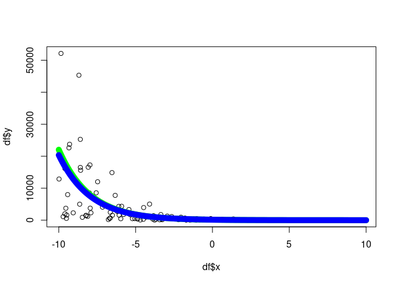

<!-- README.md is generated from README.Rmd. Please edit that file -->

# R package: `algebraic.mle`

<!-- badges: start -->
http://www.r-pkg.org/badges/version/algebraic.mle
<!-- badges: end -->

`algebraic.mle` is an R package that provides an algebra over
Maximum Likelihood Estimators (MLEs). These estimators possess
many desirable, well-defined statistical properties which the package
helps you manipulate and utilize.

## Installation

`algebraic.mle` can be installed from GitHub by using the devtools package
in R:
``` r
install.packages("devtools")
devtools::install_github("queelius/algebraic.mle")
```

## Purpose

Purpose
The primary focus of this package is the likelihood and the log-likelihood,
fundamental statistical concepts for a parametric model. They are integral
to both Bayesian and frequentist statistics, as well as for those who
prioritize likelihood. The algebraic.mle package enables easy handling of
MLEs, which, under certain conditions and assumptions (such as independence
and identical distribution (iid) for a sample), present numerous advantages,
including asymptotic normality and being the uniformly minimum variance
unbiased estimator of theta.

## API Overview

The main object in the `algebraic.mle` package is the `mle` object, which
represents a fitted model. The package provides a number of generic methods
designed for `mle` objects. A comprehensive list of functions is available
in the [function reference](https://queelius.github.io/algebraic.mle/reference/index.html)
for `algebraic.mle`.


## Example
Here is an example of fitting a conditional exponential model to some data
using `algebraic.mle`.
The true DGP is given by `Y | x ~ EXP(rate(x))` where `rate(x) = exp(b0 + b1*x)`,
and we do not care how `x` is distributed.

``` r
# Generate data (DGP)
n <- 200
b0 <- -5
b1 <- .5
df <- data.frame(x = rep(NA, n), y = rep(NA, n))
for (i in 1:n) {
    x <- runif(1, -10, 10)
    y <- rexp(n, rate = exp(b0 + b1 * x))
    df[i, ] <- c(x, y)
}
```

Now, we define three functions, `resp`, `rate`, and `loglik`, which
defines our conditional model.

``` r
resp <- function(df) df$y
rate <- function(df, beta) exp(beta[1] + beta[2] * df$x)
loglike <- function(df, resp, rate) {
  function(beta) sum(dexp(x = resp(df), rate = rate(df, beta), log = TRUE))
}
```

Let’s fit the model to the data in `df`. We’ll use the `optim` function in
`stats` to fit the model and then wrap it into an `mle` object using
`mle_numerical`.

``` r
library(algebraic.mle)
sol <- mle_numerical(optim(par = c(0, 0),
    fn = loglike(df, resp, rate),
    control = list(fnscale = -1),
    hessian = TRUE))
```

We have fit the model. We can do a lot of things with this model, for instance,
we can print out summary info:
``` r
summary(sol)
#> Maximum likelihood estimator of type mle_numerical is normally distributed.
#> The estimates of the parameters are given by:
#> [1] -5.0366809  0.4883971
#> The standard error is  0.07082793 0.01182874 .
#> The asymptotic 95% confidence interval of the parameters are given by:
#>              2.5%      97.5%
#> param1 -5.1531825 -4.9201794
#> param2  0.4689405  0.5078536
#> The MSE of the estimator is  0.005156515 .
#> The log-likelihood is  -1171.433 .
#> The AIC is  2346.866 .
```

See the API reference for more options.

Let’s plot the data, the true expectation of the
DGP (green), and the estimate of the DGP (red):

``` r
# plot the x-y points from the data frame
plot(df$x,df$y)

# now overlay a plot of the conditional mean
x <- seq(-10, 10, .1)
b0.hat <- point(sol)[1]
b1.hat <- point(sol)[2]
y.hat <- 1/exp(b0.hat + b1.hat*x)
y <- 1/exp(b0 + b1*x)
lines(x, y, col = "green", lwd = 10)
lines(x, y.hat, col = "blue", lwd = 10)
```



For a more comprehensive exploration of `algebraic.mle` and its API,
refer to the tutorials in [vignettes](https://queelius.github.io/algebraic.mle/articles/index.html).
These provide simple, yet instructive demonstrations of how to use the package
effectively.
