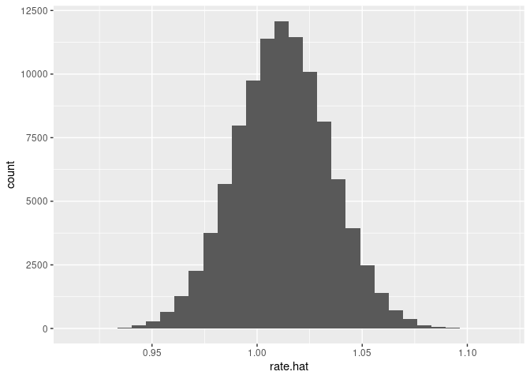

<!-- README.md is generated from README.Rmd. Please edit that file -->

# R package: `algebraic.mle`

<!-- badges: start -->
<!-- badges: end -->

An algebra over maximum likelihood estimators (MLE).

MLEs have many desirable, well-defined statistical properties. We define
an algebra over MLEs.

## Installation

You can install the development version of `algebraic.mle` from
[GitHub](https://github.com/) with:

``` r
# install.packages("devtools")
devtools::install_github("queelius/algebraic.mle")
#> Skipping install of 'algebraic.mle' from a github remote, the SHA1 (8ed1f6f5) has not changed since last install.
#>   Use `force = TRUE` to force installation
```

## Example: MLE of rate parameter in exponential distribution

Suppose we have a sample of *n* = 50 draws from EXP (*λ*=1).

``` r
library(stats)
n = 2000
rate = 1
x <- stats::rexp(n,rate)
head(x)
#> [1] 1.39230914 0.54734058 0.07918932 0.20741784 1.47882354 0.24072950
```

Then, we can estimate *λ* with:

``` r
library(algebraic.mle)
(rate.hat <- mle_exp(x))
#> $theta.hat
#> [1] 1.012049
#> 
#> $info
#>          [,1]
#> [1,] 1952.659
#> 
#> $sigma
#>              [,1]
#> [1,] 0.0005121221
#> 
#> $sample_size
#> [1] 2000
#> 
#> attr(,"class")
#> [1] "mle_exp"   "mle"       "estimator"
```

We can show the point estimator with:

``` r
point(rate.hat)
#> [1] 1.012049
```

We can show the variance with:

``` r
vcov(rate.hat)
#>              [,1]
#> [1,] 0.0005121221
```

If `rate.hat` had been a vector, `vcov` would have output a
variance-covariance martix.

We can sample from *λ̂* with:

``` r
library(ggplot2)
library(tidyverse)
#> ── Attaching packages ─────────────────────────────────────── tidyverse 1.3.1 ──
#> ✓ tibble  3.1.6     ✓ dplyr   1.0.7
#> ✓ tidyr   1.1.4     ✓ stringr 1.4.0
#> ✓ readr   2.1.1     ✓ forcats 0.5.1
#> ✓ purrr   0.3.4
#> ── Conflicts ────────────────────────────────────────── tidyverse_conflicts() ──
#> x dplyr::filter() masks stats::filter()
#> x dplyr::lag()    masks stats::lag()
library(gt)

#tibble(algebraic.mle::distr(rate.hat
#test


rate.sampler <- sampler(rate.hat)
data <- tibble(rate.hat=rate.sampler(100000))
knitr::kable(head(data))
```

|  rate.hat |
|----------:|
| 1.0134812 |
| 1.0348350 |
| 0.9845482 |
| 1.0325074 |
| 1.0023182 |
| 1.0296314 |

``` r
ggplot(data, aes(x=rate.hat)) + geom_histogram()
#> `stat_bin()` using `bins = 30`. Pick better value with `binwidth`.
```



``` r

#tibble(x=data) %>% ggplot(aes(x=x))

#df <- tibble(x=rrate.mle(2000))
#df
#exp2 <- mle_exp(df$x)
#print(exp2)
```

## Sum of maximum likelihood estimators

Since the variance-covariance of an MLE is inversely proportional to the
Fisher information that the MLE is defined with respect to, we can
combine multiple MLEs of *θ*, each of which may be defined with respect
to a different kind of sample, to arrive at the MLE that incorporates
the Fisher information in all of those samples.

Consider *k* mutually independent MLE estimators of parameter *θ*,
*θ̂*<sub>1</sub>, …, *θ̂*<sub>*k*</sub>, where
*θ̂*<sub>*j*</sub> ∼ *N*(*θ*,*I*<sub>*j*</sub><sup>−1</sup>(*θ*)).

Then, the maximum likelihood estimator of *θ* that incorporates all of
the data in *θ̂*<sub>1</sub>, …, *θ̂*<sub>*k*</sub> is given by the
inverse-variance weighted mean,
*θ̂* = (∑*I*<sub>*j*</sub>(*θ*))<sup>−1</sup>(∑*I*<sub>*j*</sub>(*θ*)*θ*<sub>*j*</sub>).
