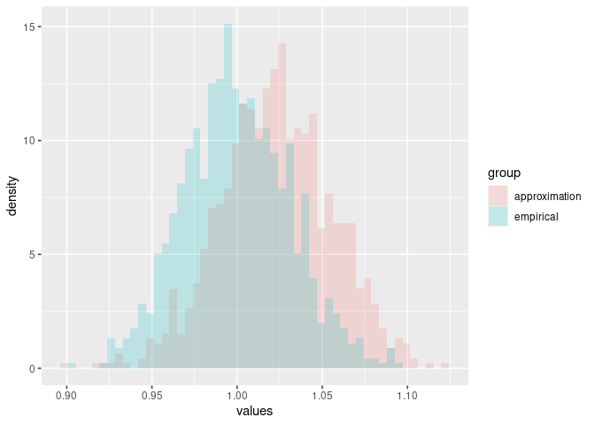

<!-- README.md is generated from README.Rmd. Please edit that file -->

# R package: `algebraic.mle`

<!-- badges: start -->
<!-- badges: end -->

An algebra over maximum likelihood estimators (MLE).

MLEs have many desirable, well-defined statistical properties. We define
an algebra over MLEs.

## Installation

You can install the development version of `algebraic.mle` from
[GitHub](https://github.com/) with:

``` r
# install.packages("devtools")
devtools::install_github("queelius/algebraic.mle")
```

## MLE of rate parameter in exponential distribution

In what follows, to demonstrate the `algebraic.mle` R package, we
consider a random sample from exponentially distributed random variable
*X*<sub>*i*</sub> ∼ EXP (*λ*=1) for *i* = 1, …, *n*.

We generate an observation from this random sample with:

``` r
library(stats)
library(tidyverse)
n <- 1000
rate <- 1
x <- tibble(x=stats::rexp(n,rate))
```

We have observed a sample of size *n* = 1000. We show some observations
from this sample (data frame) with:

``` r
print(x)
#> # A tibble: 1,000 × 1
#>        x
#>    <dbl>
#>  1 0.154
#>  2 0.128
#>  3 4.52 
#>  4 0.204
#>  5 0.341
#>  6 1.28 
#>  7 0.730
#>  8 0.552
#>  9 0.442
#> 10 0.334
#> # … with 990 more rows
```

We show a histogram of the sample, and a plot of the exponential
function’s pdf, with:

``` r
library(ggplot2)
ggplot(x, aes(x=x)) + geom_histogram(aes(y=..density..),alpha=.2) +
    xlim(0,6) + 
    geom_function(fun=dexp)
#> Warning: Removed 4 rows containing non-finite values (stat_bin).
#> Warning: Removed 2 rows containing missing values (geom_bar).
```


If we would like to estimate *λ*, we can do so using maximum likelihood
estimation as implemented by the `algebraic.mle` package:

``` r
library(algebraic.mle)
(rate.hat <- mle_exp(x$x))
#> $theta.hat
#> [1] 1.017336
#> 
#> $info
#>          [,1]
#> [1,] 966.2084
#> 
#> $sigma
#>             [,1]
#> [1,] 0.001034973
#> 
#> $sample_size
#> [1] 1000
#> 
#> attr(,"class")
#> [1] "mle_exp"   "mle"       "estimator"
```

We can show the point estimator with:

``` r
point(rate.hat)
#> [1] 1.017336
```

We can show the Fisher information and variance-covariance matrices
with:

``` r
fisher_info(rate.hat)
#>          [,1]
#> [1,] 966.2084
vcov(rate.hat)
#>             [,1]
#> [1,] 0.001034973
```

(If `rate.hat` had been a vector, `vcov` would have output a
variance-covariance matrix. We may consider the above outputs 1 × 1
matrices.)

We can show the confidence interval with:

``` r
confint(rate.hat)
#>       2.5 %   97.5 %
#> 1 0.9644199 1.070253
```

## Sampling distribution of the MLE

In general, to estimate the sampling distribution, we generate
*B* = 10000 samples (of size 1000) and their corresponding estimators,
*θ̂*<sup>(1)</sup>, …, *θ̂*<sup>(*B*)</sup>.

Normally, we do not have *B* samples, and if we did, we would gather all
*B* samples into one sample (or used a weighted MLE), which would
contain more (Fisher) information about *θ*.

However, a nice property of MLEs is that, asymptotically, they converge
to a normal distribution with a mean given by the true parameter, in
this case *λ*, and a variance-covariance given by the inverse of the
Fisher information matrix, i.e., *λ̂* ∼ *N*(*λ*,*I*<sup>−1</sup>(*λ*))
where *I* is the Fisher information matrix, in this case
*I*(*λ*) = *n*/*λ*<sup>2</sup>.

We observe the empirical sampling distribution of *θ̂* overlaid with the
theoretical asymptotic distribution with:

``` r
B <- 1000
data0 <- numeric(length=B)
for (i in 1:B)
{
    x <- stats::rexp(n,rate)
    data0[i] <- point(mle_exp(x))
}
ggplot(tibble(rate.hat=data0), aes(x=rate.hat)) +
    geom_histogram(aes(y=..density..),alpha=.3,bins=50) +
    geom_function(fun=function(x) { dnorm(x,mean=rate,sd=rate/sqrt(n)) })
```


We do not know *λ*, but we may estimate it from a sample, and thus we
may approximate the sampling distribution of *λ̂* with
*N*(*λ̂*,*I*<sup>−1</sup>(*λ̂*)).

Since we are only giving one sample, we cannot do as we did before to
provide *B* estimates of *λ*. However, we can sample from the
approximation of the asymptotic distribution of *λ̂* with:

``` r
data1 <- sampler(rate.hat)(B)
```

We visually compare the two MLE samples, `data0` and `data1`, with:

``` r
data <- data.frame(values=c(data0,data1), group=c(rep("empirical",B),rep("approximation",B)))

ggplot(data,aes(x=values,fill=group)) +
    geom_histogram(aes(y=..density..),position="identity", alpha=0.2, bins=50)
```



Due to sampling error, we see that the approximation, the estimate of
the asymptotic sampling distribution *N*(*λ̂*,*λ̂*/*n*<sup>1/2</sup>), is
shifted to the left of the sample from the true distribution, but they
appear to be quite similar otherwise.

## Invariance property of the MLE

An interesting property of an MLE *λ̂* is that the MLE of *g*(*λ*) is
given by *g*(*λ̂*).

``` r
g <- function(lambda) 2*lambda

fn_distr(rate.hat,g,100)
#> $sigma
#>             [,1]
#> [1,] 0.004631337
#> 
#> $info
#>          [,1]
#> [1,] 215.9204
#> 
#> $theta.hat
#> [1] 2.034673
#> 
#> attr(,"class")
#> [1] "mle_func"  "mle"       "estimator"
```

## Weighted MLE: a weighted sum of maximum likelihood estimators

Since the variance-covariance of an MLE is inversely proportional to the
Fisher information that the MLE is defined with respect to, we can
combine multiple MLEs of *θ*, each of which may be defined with respect
to a different kind of sample, to arrive at the MLE that incorporates
the Fisher information in all of those samples.

Consider *k* mutually independent MLE estimators of parameter *θ*,
*θ̂*<sub>1</sub>, …, *θ̂*<sub>*k*</sub>, where
*θ̂*<sub>*j*</sub> ∼ *N*(*θ*,*I*<sub>*j*</sub><sup>−1</sup>(*θ*)).

Then, the maximum likelihood estimator of *θ* that incorporates all of
the data in *θ̂*<sub>1</sub>, …, *θ̂*<sub>*k*</sub> is given by the
inverse-variance weighted mean,
*θ̂* = (∑*I*<sub>*j*</sub>(*θ*))<sup>−1</sup>(∑*I*<sub>*j*</sub>(*θ*)*θ*<sub>*j*</sub>).

To evaluate the performance of this estimator, we generate a sample of
*N* = 1000 from EXP (*λ*=1). We compute the MLE for the observed sample,
denoted by *θ*. We then divide the observed sample into *r* = 5
sub-samples, each of size *N*/*r* = 100, and compute the MLE for each
sub-sampled, denoted by *θ*<sup>(1)</sup>, …, *θ*<sup>(*r*)</sup>.
Finally, we come these MLEs into the weighted MLE, denoted by
*θ*<sub>*w*</sub>.

``` r
N <- 1000
r <- 5
data3 <- rexp(N)
data3.mat <- matrix(data3,nrow=r)
mles <- list(length=r)
for (i in 1:r)
{
    mles[[i]] <- mle_exp(data3.mat[i,])
}

mle.wt <- mle_weighted(mles)
print(mle.wt)
#> $theta.hat
#>          [,1]
#> [1,] 1.032892
#> 
#> $info
#>          [,1]
#> [1,] 936.1397
#> 
#> $sigma
#>             [,1]
#> [1,] 0.001068217
#> 
#> attr(,"class")
#> [1] "mle_weighted" "mle"          "estimate"

mle.tot <- mle_exp(data3)
print(mle.tot)
#> $theta.hat
#> [1] 1.0342
#> 
#> $info
#>          [,1]
#> [1,] 934.9557
#> 
#> $sigma
#>             [,1]
#> [1,] 0.001069569
#> 
#> $sample_size
#> [1] 1000
#> 
#> attr(,"class")
#> [1] "mle_exp"   "mle"       "estimator"

confint(mle.wt)
#>       2.5 %   97.5 %
#> 1 0.9791321 1.086652
confint(mle.tot)
#>       2.5 %   97.5 %
#> 1 0.9804061 1.087994
```

We see that *θ̂* and *θ̂*<sub>*w*</sub> model approximately the same
sampling distribution for *θ*.
