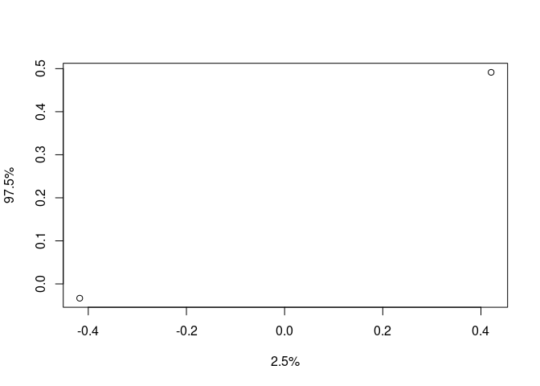

<!-- README.md is generated from README.Rmd. Please edit that file -->

# R package: `algebraic.mle`

<!-- badges: start -->
<!-- badges: end -->

An algebra over maximum likelihood estimators (MLE).

MLEs have many desirable, well-defined statistical properties. We define
an algebra over MLEs.

## Installation

You can install the development version of `algebraic.mle` from
[GitHub](https://github.com/) with:

``` r
# install.packages("devtools")
devtools::install_github("queelius/algebraic.mle")
```

## Example: MLE of rate parameter in exponential distribution

Consider an exponentially distributed random variable
*X*<sub>*i*</sub> ∼ EXP (*λ*=1) and we draw a random sample from it:

``` r
library(stats)
library(tidyverse)
#> ── Attaching packages ─────────────────────────────────────── tidyverse 1.3.1 ──
#> ✓ ggplot2 3.3.5     ✓ purrr   0.3.4
#> ✓ tibble  3.1.6     ✓ dplyr   1.0.7
#> ✓ tidyr   1.1.4     ✓ stringr 1.4.0
#> ✓ readr   2.1.1     ✓ forcats 0.5.1
#> ── Conflicts ────────────────────────────────────────── tidyverse_conflicts() ──
#> x dplyr::filter() masks stats::filter()
#> x dplyr::lag()    masks stats::lag()
n <- 1000
rate <- 1
x <- tibble(x=stats::rexp(n,rate))
```

We have observed a sample of size *n* = 1000. We show some observations
from this sample (data frame) with:

``` r
print(x)
#> # A tibble: 1,000 × 1
#>          x
#>      <dbl>
#>  1 0.283  
#>  2 0.186  
#>  3 1.73   
#>  4 0.618  
#>  5 0.00966
#>  6 3.57   
#>  7 2.42   
#>  8 0.0681 
#>  9 0.421  
#> 10 1.03   
#> # … with 990 more rows
```

We show a histogram of the sample, and a plot of the exponential
function’s pdf, with:

``` r
library(ggplot2)
ggplot(x, aes(x=x)) + geom_histogram(aes(y=..density..),alpha=.2) +
    xlim(0,6) + 
    geom_function(fun=dexp)
#> `stat_bin()` using `bins = 30`. Pick better value with `binwidth`.
#> Warning: Removed 2 rows containing non-finite values (stat_bin).
#> Warning: Removed 2 rows containing missing values (geom_bar).
```


If we would like to estimate *λ*, we can do so using maximum likelihood
estimation as implemented by the `algebraic.mle` package:

``` r
library(algebraic.mle)
(rate.hat <- mle_exp(x$x))
#> $theta.hat
#> [1] 1.025417
#> 
#> $info
#>          [,1]
#> [1,] 951.0412
#> 
#> $sigma
#>             [,1]
#> [1,] 0.001051479
#> 
#> $sample_size
#> [1] 1000
#> 
#> attr(,"class")
#> [1] "mle_exp"   "mle"       "estimator"
```

We can show the point estimator with:

``` r
point(rate.hat)
#> [1] 1.025417
```

We can show the Fisher information and variance-covariance matrices
with:

``` r
fisher_info(rate.hat)
#>          [,1]
#> [1,] 951.0412
vcov(rate.hat)
#>             [,1]
#> [1,] 0.001051479
```

(If `rate.hat` had been a vector, `vcov` would have output a
variance-covariance matrix. We may consider the above outputs 1 × 1
matrices.)

We can show the confidence interval with:

``` r
confint(rate.hat)
#>       2.5 %   97.5 %
#> 1 0.9720797 1.078753
```

### Sampling distribution of the MLE

In general, to estimate the sampling distribution, we generate
*B* = 10000 samples (of size 1000) and their corresponding estimators,
*θ̂*<sup>(1)</sup>, …, *θ̂*<sup>(*B*)</sup>. We observe the empirical
sampling distribution of *θ̂* with:

``` r
B <- 1000
data0 <- numeric(length=B)
for (i in 1:B)
{
    x <- stats::rexp(n,rate)
    data0[i] <- point(mle_exp(x))
}
ggplot(tibble(rate.hat=data0), aes(x=rate.hat)) +
    geom_histogram(alpha=.2,bins=50) +
    xlim(.89,1.11) + 
    geom_function(fun=rnorm,sigma=sqrt(n/rate))
#> Warning: Ignoring unknown parameters: sigma
#> Warning: Removed 1 rows containing non-finite values (stat_bin).
#> Warning: Removed 2 rows containing missing values (geom_bar).
```



We overlay the theoretical normal density plot.

Normally, we do not have *B* samples, and if we did, we would
incorporate all *B* samples into one sample, since the larger sample
would contain more Fisher information about *θ*.

However, a nice property of MLEs is that, asymptotically, they converge
to a normal distribution with a mean given by the true parameter and a
variance-covariance given by the inverse of the Fisher information
matrix, i.e., *λ̂* ∼ *N*(*λ*,*I*<sup>−1</sup>(*λ*)) where *I* is the
Fisher information matrix. In this case, it is
*I*(*λ*) = *n*/*λ*<sup>2</sup>. We do not know *λ*, but we may estimate
it from a sample, and thus we may approximate the sampling distribution
of *λ̂* with *N*(*λ̂*,*I*<sup>−1</sup>(*λ̂*)).

We sample from the asymptotic distribution of *λ̂* with:

``` r
data1 <- sampler(rate.hat)(B)
```

Now, we wish to compare the empirical sampling distribution, `data0`,
with the empirical asymptotic distribution, `data1`, along with its
probability density plot:

``` r
data <- data.frame(values=c(data0,data1), group=c(rep("empirical",B),rep("asymptotic",B)))

ggplot(data,aes(x=values,fill=group)) +
    geom_histogram(aes(y=..density..),position="identity", alpha=0.2, bins=50) +
    geom_density(alpha=.1)
```


### Invariance property of the MLE

## Sum of maximum likelihood estimators

Since the variance-covariance of an MLE is inversely proportional to the
Fisher information that the MLE is defined with respect to, we can
combine multiple MLEs of *θ*, each of which may be defined with respect
to a different kind of sample, to arrive at the MLE that incorporates
the Fisher information in all of those samples.

Consider *k* mutually independent MLE estimators of parameter *θ*,
*θ̂*<sub>1</sub>, …, *θ̂*<sub>*k*</sub>, where
*θ̂*<sub>*j*</sub> ∼ *N*(*θ*,*I*<sub>*j*</sub><sup>−1</sup>(*θ*)).

Then, the maximum likelihood estimator of *θ* that incorporates all of
the data in *θ̂*<sub>1</sub>, …, *θ̂*<sub>*k*</sub> is given by the
inverse-variance weighted mean,
*θ̂* = (∑*I*<sub>*j*</sub>(*θ*))<sup>−1</sup>(∑*I*<sub>*j*</sub>(*θ*)*θ*<sub>*j*</sub>).
