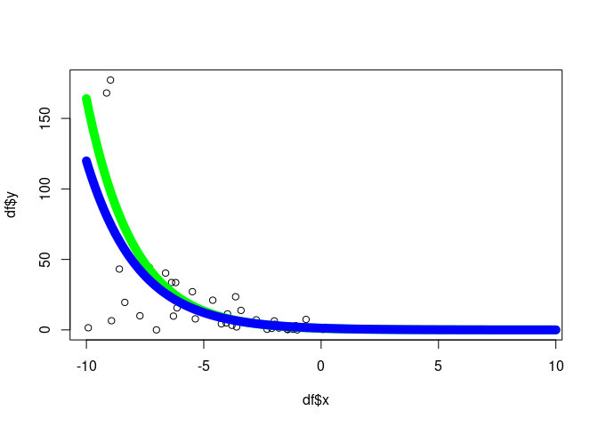

<!-- README.md is generated from README.Rmd. Please edit that file -->

# R package: `algebraic.mle`

<!-- badges: start -->

<!-- badges: end -->

An algebra over maximum likelihood estimators (MLE).

MLEs have many desirable, well-defined statistical properties. We define
an algebra over MLEs.

## Installation

You can install `algebraic.mle` from
[GitHub](https://github.com/queelius/algebraic.mle) with:

``` r
install.packages("devtools")
devtools::install_github("queelius/algebraic.mle")
```

## API

The object representing a fitted model is a type of `mle` object, the
maximum likelihood estimator of the model with respect to observed data.

The API mostly consists of generic methods with implementations for
various `mle` type objects. For a full list of functions, see the
[function
reference](https://queelius.github.io/algebraic.mle/reference/index.html)
for `algebraic.mle`.

Let’s fit a conditional exponential model to some data. In this model,
`Y | x ~ EXP(rate(x))` where `rate(x) = exp(b0 + b1*x)`. First, let’s
create the DGP (data generating process):

``` r
dgp <- function(n, x, b0, b1) {
    rate <- exp(b0 + b1 * x)
    rexp(n, rate)
}
```

Let’s generate some date:

``` r
n <- 200
b0 <- -5
b1 <- .5
df <- data.frame(x = rep(NA, n), y = rep(NA, n))
for (i in 1:n) {
    x <- runif(1, -10, 10)
    y <- dgp(n = 1, x = x, b0 = b0, b1 = b1)
    df[i, ] <- c(x, y)
}
```

Now, we define two functions, `resp`, `rate`, and `loglik` function
which will be used to define the model.

``` r
resp <- function(df) df$y
rate <- function(df, beta) exp(beta[1] + beta[2] * df$x)
loglike <- function(df, resp, rate) {
  function(beta) sum(dexp(x = resp(df), rate = rate(df, beta), log = TRUE))
}
```

Let’s fit the model. We’ll use the `optim` function in `stats` to fit
the model and then wrap it into an `mle` object using `mle_numerical`.

``` r
library(algebraic.mle)
sol <- mle_numerical(optim(par = c(0, 0),
    fn = loglike(df, resp, rate),
    control = list(fnscale = -1),
    hessian = TRUE))
summary(sol)
#> Maximum likelihood estimator of type mle_numerical is normally distributed.
#> The estimates of the parameters are given by:
#> [1] -5.0366809  0.4883971
#> The standard error is  0.07082793 0.01182874 .
#> The asymptotic 95% confidence interval of the parameters are given by:
#>              2.5%      97.5%
#> param1 -5.1531825 -4.9201794
#> param2  0.4689405  0.5078536
#> The MSE of the estimator is  0.005156515 .
#> The log-likelihood is  -1171.433 .
#> The AIC is  2346.866 .
```

Let’s plot it:

``` r
# plot the x-y points from the data frame
plot(df$x,df$y)

# now overlay a plot of the conditional mean
x <- seq(-10, 10, .1)
b0.hat <- point(sol)[1]
b1.hat <- point(sol)[2]
y.hat <- 1/exp(b0.hat + b1.hat*x)
y <- 1/exp(b0 + b1*x)
lines(x, y, col = "green", lwd = 10)
lines(x, y.hat, col = "blue", lwd = 10)
```



You can see tutorials for more examples of using the package in the
[vignettes](https://queelius.github.io/algebraic.mle/articles/index.html).
