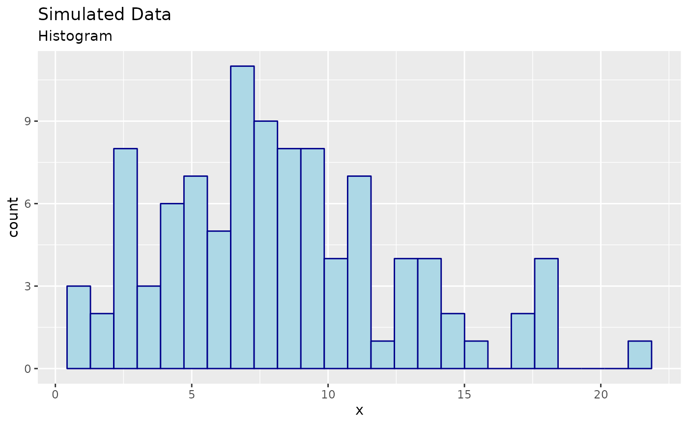
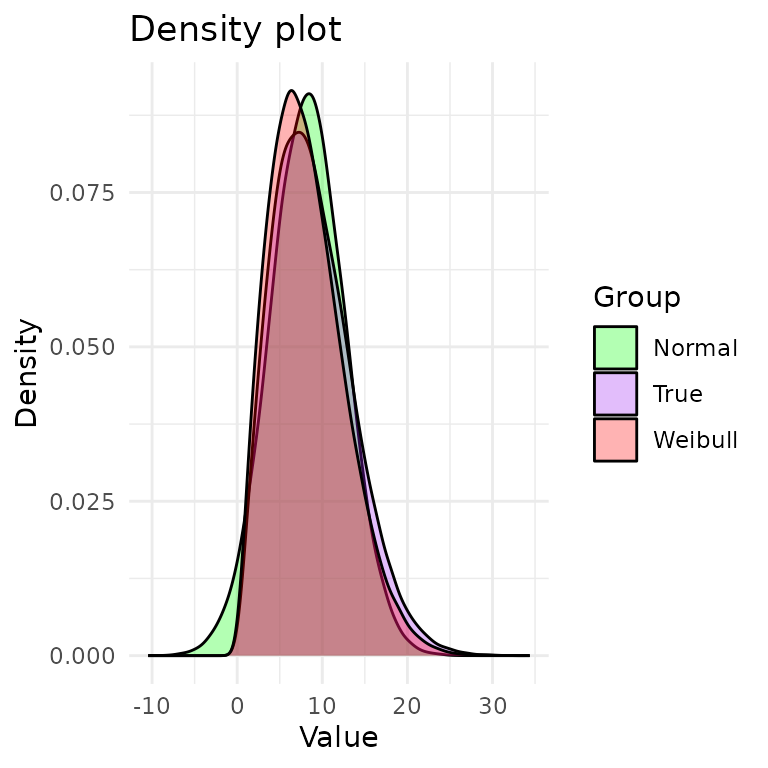

# Fitting Common Distributions to a DGP

``` r
library(algebraic.mle)
library(algebraic.dist)
library(boot)
```

## Introduction

The goal of this vignette is to demonstrate using the R package
`algebraic.mle` for inference on maximum likelihood estimators (MLEs).
We will simulate a dataset whose true data generating process (DGP) is a
mixture of Weibull and Normal distributions. However, we will fit
Weibull and Normal distributions separately to the data to explore which
provides a better fit.

## Data Simulation

First, here are the simulation parameters:

``` r
n <- 100
err <- 0.1
shape <- 2
scale <- 10
theta = c(shape, scale)
set.seed(142334)
```

We simulate a sample of size $n = 100$ from the DGP:
$$T_{i} = W_{i} + \epsilon_{i}$$ where
$$W_{i} \sim \operatorname{Weibull}(k = 2,\lambda = 10)$$ and
$$\epsilon_{i} \sim \operatorname{normal}(\mu = 0,\sigma = 0.1).$$

We can simulate a sample from this DGP mixture distribution using the
`rweibull` and `rnorm` functions:

``` r
x <- rweibull(n = n, shape = shape, scale = scale) +
  rnorm(n = n, mean = 0, sd = err)
```

## Visualizing Data

Here are some observations:

``` r
head(x, n = 4)
#> [1]  6.69  2.96 13.05  5.34
```

Visualizing the data is a good first step in the analysis of the data.
If the data is univariate or bivariate, we can plot a histogram of the
data pretty easily. We show a histogram of the simulated data below:


## Parametrically Modeling the Data

If we only had this sample, what might we conclude? This can be a very
difficult problem.

If we were only interested in, say, *prediction*, and we had a
sufficiently large sample, we could use a non-parametric methods and
“let the data speak for itself.” However, if we are interested in
inference (e.g., explaining the data) or the sample was small, then we
usually need to make some assumptions about the data.

In this case, we will assume that the data is drawn from a parametric
distribution. There are many well-known, named parametric distributions,
e.g., Pareto, Weibull, and Normal, to name a few. We will fit the
Weibull and the Normal distributions, and compare the results.

## Maximum Likelihood Estimation

We will use maximum likelihood estimation (MLE) to estimate the
parameters of both the Weibull and the Normal, and then wrap these
estimates into an `mle` object provided by `algebraic.mle` package:

``` r
fit_normal <- function(data) {
    loglik <- function(theta) {
        sum(dnorm(data, mean = theta[1], sd = sqrt(theta[2]), log = TRUE))
    }
    mu.hat <- mean(data)
    sigma2.hat <- mean((data - mu.hat)^2)
    H <- -numDeriv::hessian(loglik, c(mu.hat, sigma2.hat))
    mle(theta.hat = c(mu.hat, sigma2.hat),
        loglike = loglik(c(mu.hat, sigma2.hat)),
        score = numDeriv::grad(loglik, c(mu.hat, sigma2.hat)),
        sigma = MASS::ginv(H),
        info = H,
        obs = data,
        nobs = length(data),
        superclasses = c("mle_normal"))
}

fit_weibull <- function(data) {
    loglik <- function(theta) {
        sum(dweibull(data, shape = theta[1], scale = theta[2], log = TRUE))
    }

    sol <- stats::optim(
        par = c(shape, scale),
        fn = loglik,
        hessian = TRUE,
        method = "L-BFGS-B",
        lower = c(0, 0),
        #method = "Nelder-Mead",
        control = list(maxit = 10000, fnscale = -1))

    mle(theta.hat = sol$par,
        loglike = sol$value,
        sigma = MASS::ginv(-sol$hessian),
        info = -sol$hessian,
        obs = data,
        nobs = length(data),
        superclasses = c("mle_weibull"))
}

bias.mle_normal <- function(x, theta = NULL) {
    if (is.null(theta))
        theta <- params(x)
    c(0, -theta[2] / nobs(x))
}

theta.hat <- fit_normal(x)
summary(theta.hat)
#> Maximum likelihood estimator of type mle_normal is normally distributed.
#> The estimates of the parameters are given by:
#> [1]  8.23 19.11
#> The standard error is  0.437 2.7 .
#> The asymptotic 95% confidence interval of the parameters are given by:
#>         2.5% 97.5%
#> param1  7.37  9.09
#> param2 13.82 24.41
#> The MSE of the individual components in a multivariate estimator is:
#>                  [,1]             [,2]
#> [1,] 0.19112701130551 0.00000000000607
#> [2,] 0.00000000000607 7.34243642454061
#> The log-likelihood is  -289 .
#> The AIC is  583 .

theta.weibull <- fit_weibull(x)
summary(theta.weibull)
#> Maximum likelihood estimator of type mle_weibull is normally distributed.
#> The estimates of the parameters are given by:
#> [1] 1.95 9.27
#> The standard error is  0.153 0.5 .
#> The asymptotic 95% confidence interval of the parameters are given by:
#>        2.5% 97.5%
#> param1 1.65  2.25
#> param2 8.29 10.25
#> The MSE of the individual components in a multivariate estimator is:
#>        [,1]   [,2]
#> [1,] 0.0235 0.0237
#> [2,] 0.0237 0.2497
#> The log-likelihood is  -284 .
#> The AIC is  573 .
```

Let’s plot the pdfs of the Weibull and normal distributions:


In purple, we have the true density (DGP). In red, we have the Weibull
density. In green, we have the normal density. From the plot, it’s hard
to tell which distribution is a better fit to the DGP.

Interestingly, the tails of the true distribution seem a bit heavier
than the tails of the Weibull and Normal. This may suggest that a
heavier-tailed model may be a better fit, such as the lognormal
distribution, but we will not pursue this.

### Performance Measures of the MLE

A nice property of MLEs is that, asymptotically, given some regularity
conditions, they are normally distributed with a mean given by the true
true parameter and a variance-covariance given by the inverse of the FIM
evaluated at $\theta$.

We do not know $\theta$, but we have have estimates, and thus we may
approximate the sampling distribution of $\widehat{\theta}$ with
$\mathcal{N}\left( \widehat{\theta},I^{- 1}\left( \widehat{\theta} \right) \right)$.

Let $F$ denote the true distribution function such that $X_{j} \sim F$
for all $j$. Suppose we have some population parameter $\theta = t(F)$
and an estimator of $\theta$ given by
$\widehat{\theta} = s\left( \{ X_{1},\ldots,X_{n}\} \right)$. A
reasonable requirement for an estimator $\widehat{\theta}$ is that it
converges to the true parameter value $\theta$ as we collect more and
more data. In particular, we say that it is a consistent estimator of
$\theta$ if $\widehat{\theta}$ converges in probability to $\theta$,
denoted by $\widehat{\theta}\overset{p}{\mapsto}\theta$.

If the regularity conditions hold for the MLE, then $\widehat{\theta}$
is a consistent estimator of $\theta$. However, for finite sample sizes,
the estimator may be biased. The bias of $\widehat{\theta}$ with respect
to $\theta$ is defined as
$$\operatorname{bias}\left( \widehat{\theta},\theta \right) = E\left( \widehat{\theta} \right) - \theta,$$
where $\operatorname{bias}\left( \widehat{\theta},\theta \right) = 0$
indicates that $\widehat{\theta}$ is an *unbiased* estimator of
$\theta$.

As a function of the true distribution $F$, the bias is unknown and is
not a statistic. However, in the case of the normal, $\widehat{\mu}$ is
unbiased and, analytically, the bias of ${\widehat{\sigma}}^{2}$ is
given by $- \frac{1}{n}\sigma^{2}$:

``` r
bias(theta.hat,theta)
#> [1]  0.0 -0.1
```

If $\sigma^{2}$ is not known, we may estimate it by using replacing
${\widehat{\sigma}}^{2}$ instead:

``` r
bias(theta.hat)
#> [1]  0.000 -0.191
```

This is pretty far off from the true bias. This may be the first
indication that the DGP is far from being normal.

If we wanted to estimate the bias for the Weibull, we could bootstrap it
or something else, but we don’t attempt to do that here.

The mean squared error (MSE) is another performance measure of an
estimator. It is given by
$$\operatorname{mse}\left( \widehat{\theta} \right) = E\{\left( \widehat{\theta} - \theta \right)^{T}\left( \widehat{\theta} - \theta \right)\},$$
Another way to compute the MSE is given by
$$\operatorname{mse}\left( \widehat{\theta} \right) = \operatorname{trace}(\operatorname{cov}\left( \widehat{\theta} \right) + \operatorname{bias}\left( \widehat{\theta} \right)^{T}\operatorname{bias}\left( \widehat{\theta} \right).$$

Here’s R code to compute the MSE of $\widehat{\theta}$:

``` r
round(mse(theta.hat), digits=3)
#>       [,1] [,2]
#> [1,] 0.191 0.00
#> [2,] 0.000 7.34
round(mse(theta.weibull), digits=3)  # true MSE
#>       [,1]  [,2]
#> [1,] 0.023 0.024
#> [2,] 0.024 0.250
```

The normal distribution has significant MSE compared to the Weibull.

## Invariance Property of the MLE

An interesting property of an MLE $\widehat{\theta}$ is that the MLE of
$f(\theta)$ is given by $f\left( \widehat{\theta} \right)$. What is the
distribution of $f\left( \widehat{\theta} \right)$? Asymptotically, it
is normally distributed with a mean given by $f(\theta)$ and a
variace-covariance given by the covariance of the sampling distribution
of $f\left( \widehat{\theta} \right)$.

We provide two methods to compute the variance-covariance.

### Delta Method

If $f$ is differentiable, the variance-covariance is given by
$$\operatorname{var}\left( f\left( \widehat{\theta} \right) \right) = E\{(f\left( \widehat{\theta} \right) - f(\theta))^{2}\} = E\{ J_{f}\left( \widehat{\theta} \right)I\left( \widehat{\theta} \right)^{- 1}J_{f}\left( \widehat{\theta} \right)^{T}\}.$$
Here, $J_{f}\left( \widehat{\theta} \right)$ is the Jacobian of $f$
evaluated at $\widehat{\theta}$.

### Monte-Carlo Method

The delta method requires that $f$ be differentiable, but we may use the
Monte-carlo method to estimate the distribution of
$f\left( \widehat{\theta} \right)$ for any function $f$. We simply
sample from the MLE of $\widehat{\theta}$ and apply $f$ to its estimates
and take the covariance of the sample.

Next, we show how to compute the sampling distribution of
$g\left( \widehat{\theta} \right)$ for some function $g$ and some MLE
$\widehat{\theta}$ using both the delta and mc methods.

### Example 1

For this example, we use the Weibull fit. Let $g(\theta) = A\theta + b$
for some matrix $A$ and vector $b$. (This is a simple linear
transformation of $\theta$.) We can define $g$ in R with:

``` r
A <- matrix(c(2,3),nrow=2)
b <- c(1,0)
g <- function(x) A %*% x + b
```

We compute the variance-covariance of the MLE of $g(\theta)$ using both
methods:

``` r
g.mc <- rmap(theta.weibull,g,n=100000L)
g.delta <- rmap(theta.weibull,g,method="delta")
round(vcov(g.mc), digits=3)
#>       [,1]  [,2]  [,3]  [,4]
#> [1,] 0.095 0.142 0.095 0.143
#> [2,] 0.142 0.213 0.143 0.214
#> [3,] 0.095 0.143 1.003 1.504
#> [4,] 0.143 0.214 1.504 2.256
round(vcov(g.delta), digits=3)
#>       [,1]  [,2]  [,3]  [,4]
#> [1,] 0.094 0.141 0.095 0.142
#> [2,] 0.141 0.211 0.142 0.213
#> [3,] 0.095 0.142 0.999 1.498
#> [4,] 0.142 0.213 1.498 2.247
```

They are pretty close.

## Weighted MLE: A Weighted Sum of MLEs

Since the variance-covariance of an MLE is inversely proportional to the
Fisher information that the MLE is defined with respect to, we can
combine multiple MLEs of $\theta$, each of which may be defined with
respect to a different kind of sample, to arrive at the MLE that
incorporates the Fisher information in all of those samples.

Consider $k$ mutually independent MLEs of parameter $\theta$,
${\widehat{\theta}}_{1},\ldots,{\widehat{\theta}}_{k}$, where
${\widehat{\theta}}_{j} \sim N\left( \theta,I_{j}^{- 1}(\theta) \right)$.
Then, the sampling MLE of $\theta$ that incorporates all of the data in
${\widehat{\theta}}_{1},\ldots,{\widehat{\theta}}_{k}$ is given by the
inverse-variance weighted mean,
$${\widehat{\theta}}_{w} = \left( \sum\limits_{j = 1}^{k}I_{j}(\theta) \right)^{- 1}\left( \sum\limits_{j = 1}^{k}I_{j}(\theta){\widehat{\theta}}_{j} \right),$$
which, asymptotically, has an expected value of $\theta$ and a
variance-covariance of
$\left( \sum_{j = 1}^{k}I_{j}(\theta) \right)^{- 1}$.

### Example 2

For this example, we use the normal fit.

To evaluate the performance of the weighted MLE, we generate a sample of
$N = 1000$ observations from $\mathcal{N}(\theta)$ and compute the MLE
for the observed sample, denoted by $\widehat{\theta}$.

We then divide the observed sample into $r = 5$ sub-samples, each of
size $N/r = 100$, and compute the MLE for each sub-sampled, denoted by
$\theta^{(1)},\ldots,\theta^{(r)}$.

Finally, we do a weighted combination these MLEs to form the weighted
MLE, denoted by $\theta_{w}$:

``` r
N <- 500
r <- 5
samp <- rnorm(N, mean = theta[1], sd = sqrt(theta[2]))
samp.sub <- matrix(samp, nrow = r)
mles.sub <- list(length = r)
for (i in 1:r)
    mles.sub[[i]] <- fit_normal(samp.sub[i,])

mle.wt <- mle_weighted(mles.sub)
mle <- fit_normal(samp)
```

We show the results in the following R code. First, we show the weighted
MLE and its MSE:

``` r
params(mle.wt)
#> [1] 1.98 8.71
round(mse(mle.wt), digits=3)
#>       [,1]  [,2]
#> [1,] 0.018 0.000
#> [2,] 0.000 0.313
```

The MLE for the total sample and its MSE is:

``` r
params(mle)
#> [1] 1.98 9.28
round(mse(mle), digits=3)
#>       [,1]  [,2]
#> [1,] 0.019 0.000
#> [2,] 0.000 0.345
```

We see that $\widehat{\theta}$ and ${\widehat{\theta}}_{w}$ model
approximately the same sampling distribution.

## Bootstrapping the MLEs

Let’s compare the earlier results that relied on the large sampling
assumption with the bootstrapped MLE using `mle_boot`. First, `mle_boot`
is just a wrapper for `boot` objects or objects like `boot`. Thus to use
`mle_boot`, we first need to call `boot` to bootstrap our MLE for the
Weibull fit.

We just need to wrap it in a function that takes the data as input and
returns the MLE of the parameters and then pass it to `mle_boot`
constructor:

``` r
theta.boot <- mle_boot(
    boot(data = x,
         statistic = function(x, i) params(fit_weibull(x[i])),
         R = 1000))
```

We already printed out the `theta.boot` object, which provided a lot of
information about it, but we can obtain specified statistics from the
Bootstrap MLE using the standard interface in `algorithmic.mle`, e.g.:

``` r
print(theta.boot)
#> Maximum likelihood estimator of type mle_boot is normally distributed.
#> The estimates of the parameters are given by:
#> [1] 1.95 9.27
#> The standard error is  0.153 0.501 .
#> The asymptotic 95% confidence interval of the parameters are given by:
#>        2.5% 97.5%
#> param1 1.64  2.23
#> param2 8.31 10.28
#> The MSE of the individual components in a multivariate estimator is:
#>        [,1]   [,2]
#> [1,] 0.0235 0.0283
#> [2,] 0.0283 0.2519
bias(theta.boot)
#> [1]  0.0159 -0.0228
```

We see that, for the most part, the results are similar to those
obtained using the large sampling assumption.

## Goodness-of-Fit

We are fitting a model to the data that does not precisely capture the
generative model $W$. So, how good of a fit is it?

We will conduct a goodness of fit test, $$\begin{aligned}
H_{0} & {:\text{the data is compatible with the Weibull distribution}} \\
H_{A} & {:\text{the data is not compatible with the Weibull distribution}.}
\end{aligned}$$

To perform this test, we will use the Cramer-von Mises test. This test
is based on the Cramer-von Mises statistic, which is a measure of the
distance between the empirical distribution function of the data and the
distribution function of the model. The Cramer-von Mises statistic is
given by
$${\widehat{D}}_{n}^{2} = \frac{1}{n}\sum\limits_{i = 1}^{n}\left( {\widehat{F}}_{n}\left( x_{i} \right) - F\left( x_{i} \right) \right)^{2}$$
where ${\widehat{F}}_{n}$ is the empirical distribution function of the
data and $F$ is the distribution function of the model.

``` r
cramer.test <- function(obs.dat,ref.dat)
{
  stat <- CDFt::CramerVonMisesTwoSamples(obs.dat,ref.dat)
  list(p.value=exp(-stat)/6.0,
       cramer.stat=stat,
       obs.size=length(obs.dat),
       ref.size=length(ref.dat))
}

wei.shape <- params(theta.weibull)[1]
wei.scale <- params(theta.weibull)[2]
ref.dat <- rweibull(1000000, shape = wei.shape, scale = wei.scale)
cramer.test(x, ref.dat)
#> $p.value
#> [1] 0.16
#> 
#> $cramer.stat
#> [1] 0.042
#> 
#> $obs.size
#> [1] 100
#> 
#> $ref.size
#> [1] 1000000
```

Looking at the $p$-value, we see that the data is compatible with the
Weibull distribution. Now, let’s do the same for the normal
distribution:

``` r
norm.mu <- params(theta.hat)[1]
norm.var <- params(theta.hat)[2]
ref.dat <- rnorm(1000000, mean = norm.mu, sd = sqrt(norm.var))
cramer.test(x, ref.dat)
#> $p.value
#> [1] 0.149
#> 
#> $cramer.stat
#> [1] 0.112
#> 
#> $obs.size
#> [1] 100
#> 
#> $ref.size
#> [1] 1000000
```

They are both compatible with the data. However, the Weibull
distribution has a larger $p$-value, which may suggest it is a better
fit. We also have the AIC measure of goodness of fit. The AIC is given
by $$\text{AIC} = - 2\log L + 2k,$$ where $L$ is the likelihood of the
model and $k$ is the number of parameters in the model. The AIC is a
measure of the tradeoff between the goodness of fit and the complexity
of the model.

``` r
aic(theta.weibull)
#> [1] 573
aic(theta.hat)
#> [1] 583
```

A lower AIC value indicates a better fit. Thus, according to this
measure, the Weibull distribution is the better fit.

## Prediction Intervals

Frequently, we are actually interested in predicting the outcome of the
random variable (or vector) that we are estimating the parameters of.

We observed a sample $\mathcal{D} = \{ T_{i}\}_{i = 1}^{n}$ where
$T_{i} \sim N\left( \mu,\sigma^{2} \right)$,
$\theta = \left( \mu,\sigma^{2} \right)^{T}$ is not known. We compute
the MLE of $\theta$, which, asymptotically, is normally distributed with
a mean $\theta$ and a variance-covariance $I^{- 1}(\theta)/n$.

We wish to model the uncertainty of a new observation,
${\widehat{T}}_{n + 1}|\mathcal{D}$. We do so by considering both the
uncertainty inherent to the Normal distribution and the uncertainty of
our estimate $\widehat{\theta}$ of $\theta$. In particular, we let
${\widehat{T}}_{n + 1}|\widehat{\theta} \sim N\left( \widehat{\mu},{\widehat{\sigma}}^{2} \right)$
and $\widehat{\theta} \sim N\left( \theta,I^{- 1}(\theta)/n \right)$
(the sampling distribution of the MLE). Then, the joint distribution of
${\widehat{T}}_{n + 1}$ and $\widehat{\theta}$ has the pdf given by
$$f(t,\theta) = f_{\widehat{T}|\widehat{\theta}}\left( t|\theta = \left( \mu,\sigma^{2} \right) \right)f_{\widehat{\theta}}(\theta),$$
and thus to find $f(t)$, we marginalize over $\theta$, obtaining
$$f(t) = \int_{- \infty}^{\infty}\int_{- \infty}^{\infty}f_{{\widehat{T}}_{n + 1},\widehat{\mu},{\widehat{\sigma}}^{2}}\left( t,\mu,\sigma^{2} \right)d\mu d\sigma^{2}.$$

Given the information in the sample, the uncertainty in the new
observation is characterized by the distribution
$${\widehat{T}}_{n + 1} \sim f(t).$$

It has greater variance than $T_{n + 1}|\widehat{\theta}$ because, as
stated earlier, we do not know $\theta$, we only have an uncertain
estimate $\widehat{\theta}$.

In `pred`, we compute the predictive interval (PI) of the distribution
of ${\widehat{T}}_{n + 1}$ using Monte Carlo simulation, where we
replace the integral with a sum over a large number of draws from the
joint distribution of ${\widehat{T}}_{n + 1}$ and $\widehat{\theta}$ and
then compute the empirical quantiles.

The function `pred` takes as arguments `x`, in this case an `mle`
object, and a sampler for the distribution of the random variable of
interest, in this case `rweibull` (the sampler for the normal
distribution). The sampler must be compatible with the output of
`point(x)`, whether that output be a scalar or a vector. Here is how we
compute the PI for ${\widehat{T}}_{n + 1}$:

``` r
pred(x=theta.hat, samp=function(n=1, theta) rnorm(n,theta[1],theta[2]))
#>      mean lower upper
#> [1,] 8.39 -29.8  46.6
```

In general, it will return a $p$-by-$3$ matrix, where $p$ is the
dimension of $T$ and the columns are the mean, lower quantile, and upper
quantile of the predictive distribution.

How does this compare to $T_{n + 1}|\widehat{\theta}$? We can compute
the 95% quantile interval for $T_{n + 1}|\widehat{\theta}$ using the
`qnorm` function:

``` r
mu <- params(theta.hat)[1]
sd <- sqrt(params(theta.hat)[2])
c(mean=mu,lower=qnorm(.025,mean=mu, sd=sd),upper=qnorm(.975,mean=mu, sd=sd))
#>   mean  lower  upper 
#>  8.230 -0.338 16.799
```

We see that the 95% quantile interval for $T_{n + 1}|\widehat{\theta}$
is smaller than ${\widehat{T}}_{n + 1}$, which is what we expected.
After all, there is uncertainty about the parameter value $\theta$.

## Conclusion

In this vignette, we demonstrated how to use the `algebraic.mle` package
to estimate the sampling distribution of the MLE using the large
sampling assumption and the Bootstrap method. The package provides
various functions for obtaining statistics of the MLE, allowing for a
deeper understanding of the properties of your estimator.

We showed how to fit Weibull and Normal distributions to a simulated
dataset whose true distribution, while known, does not have a common
name.

We have shown how to compare the two models using the Cramer-von Mises
test and the AIC measure of goodness of fit. We came to no definitive
conclusion about which model is better, but the Weibull distribution has
a larger $p$-value from the Cramer-von Mises test, and a lower AIC
value, which serves as some evidence that it is a better fit. We saw the
true DGP is visually different from both the Weibull and the normal
distributions. Notably, the DGP has longer tails than both, suggesting
that an even better fit may be a long-tail distribution like the
log-normal or the Pareto distribution.
