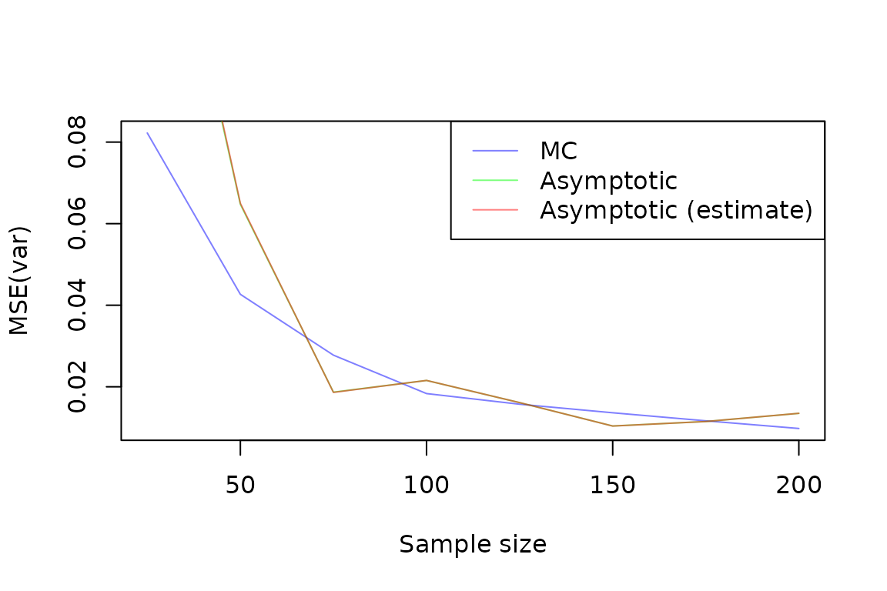

# Statistics and characteristics of the MLE

[](https://www.gnu.org/licenses/gpl-3.0)

`algebraic.mle` is an R package that provides an algebra over Maximum
Likelihood Estimators (MLEs). These estimators possess many desirable,
well-defined statistical properties which the package helps you
manipulate and utilize.

## Installation

The R package `algebraic.mle` can be installed from GitHub by using the
devtools package in R:

``` r
install.packages("devtools")
devtools::install_github("queelius/algebraic.mle")
```

## Normal distribution

We are going to the classic Normal distribution to demonstrate how to
use `algebraic.mle`. We are using it for a few reasons:

1.  It’s well-understood, so we can compare our results to the known
    results.
2.  It’s a very common distribution, so it’s useful to have a good
    understanding of its properties.
3.  The MLE is multivariate, so we can demonstrate how to use
    `algebraic.mle` for multivariate distributions.

So, first, we define a simple MLE solver for the normal distribution.

``` r
fit_normal <- function(data) {
    sigma <- function(data) {
        mean((data - mean(data))^2)
    }
    loglik <- function(par, data) {
        n <- length(data)
        -n / 2 * log(2 * pi * par[2]) - 1 / (2 * par[2]) *
            (sum(data^2) - 2 * par[1] * sum(data) + n * par[1]^2)
    }
    par.hat <- c(mu = mean(data), var = sigma(data))
    H <- numDeriv::hessian(func = loglik, x = par.hat, data = data)
    algebraic.mle::mle(
        theta.hat = par.hat,
        loglike = loglik(par.hat, data),
        score = numDeriv::grad(func = loglik, x = par.hat, data = data),
        sigma = MASS::ginv(-H),
        info = -H,
        obs = NULL,
        nobs = length(data),
        superclasses = c("mle_normal"))
}
```

As you can see, we return an `mle` object, and then we give it a
sub-class `mle_normal` (it is also a subclass of `mle` and
`algebraic.dist`’s `dist`) so we can specialize some of the methods for
MLE of the normal distribution, e.g., `bias.mle_normal` which we show
later.

## Monte-carlo (MC) simulation of the sampling distribution of the MLE

Let’s define `theta_samp_mc`, which stands for the Monte Carlo
simulation of the sampling distribution of the MLE. It takes a sample
size `n`, a true parameter value `theta`, and a number of simulations
`B` to run. It returns a matrix with `B` rows and two columns, the first
column is the MLE of the mean and the second column is the MLE of the
variance.

``` r
theta_samp_mc <- function(n, theta, B = 10000) {
    mu <- theta[1]
    var <- theta[2]
    mles <- matrix(NA, nrow = B, ncol = 2)
    for (i in 1:B) {
        d <- rnorm(n, mean = mu, sd = sqrt(var))
        mles[i, ] <- params(fit_normal(d))
    }
    colnames(mles) <- c("mu", "var")
    mles
}
```

``` r
# Set up the parameters of a simulation
set.seed(913254)
n <- 70
mu <- 1
var <- 1
B <- 1000
theta <- c(mu, var)
mles <- theta_samp_mc(n = n, theta = theta, B = B)
head(mles)
#>         mu   var
#> [1,] 0.891 0.728
#> [2,] 1.033 1.102
#> [3,] 1.105 1.094
#> [4,] 1.146 0.832
#> [5,] 0.916 0.895
#> [6,] 0.986 0.904
```

The matrix `mles` is a sample of MLEs from the sampling distribution of
the MLE. It is an *empirical distribution* of the MLE
$\left( \mu,\sigma^{2} \right)\prime$ from samples of size
$n$$X_{i} \sim N\left( \mu,\sigma^{2} \right)$ for $i = 1,\ldots,n$.

This particular example is Monte Carlo simulation of the sampling
distribution, since we are simulating the sampling distribution by
repeatedly sampling from the population distribution and computing the
MLE for each sample.

> In bootstrap, we would *resample* from the sample, not the population,
> but with a large enough sample, the two will produce nearly identical
> results. See the bootstrap section for more details, where we’ll
> compare the two.

For a sufficiently large number of simulations $B$, the empirical
sampling distribution should be very close to the true sampling
distribution. We can plot the empirical sampling distribution of the
MLEs using the `plot` function on the `mles` matrix.


Sampling distribution of the MLEs.

In `algebraic.dist`, we can use `empirical_dist` to represent an
empirical sampling distribution by giving it the sample of MLEs
previously generated:

``` r
theta.mc <- algebraic.dist::empirical_dist(mles)
```

In general, for any MLE and assuming the the regularity conditions hold,
the asymptotic sampling distribution of the MLE is normal with mean
$\theta$ and variance-covariance matrix $\Sigma = I^{- 1}(\theta)_{n}$,
where $I$ is the Fisher information matrix and $n$ is the sample size.
However, in general:

1.  We don’t know when the asymptotic sampling distribution is a good
    approximation to the true sampling distribution. In these cases, the
    empirical sampling distribution may be used instead.
2.  We may not be confident our implementation of the MLE is correct, in
    which case the empirical sampling distribution can be used to check
    our implementation.
3.  The regularity conditions may not hold, in which case the asymptotic
    sampling distribution may not be known. In these cases, the
    empirical sampling distribution may be used instead.

With these caveats in mind, we compare some of the statistics of the
empirical sampling distribution of the MLE for the normal distribution
and the asymptotic sampling distribution.

Let’s look at some basic parameters of the sampling distribution of the
MLE for the normal distribution. First, let’s look at the mean:

``` r
(mu.mc <- mean(theta.mc))
#>    mu   var 
#> 0.995 0.982
```

The mean looks pretty close to the true parameter vector
$$\theta = \left( \mu = 1,\sigma^{2} = 1 \right)\prime.$$

We can actually compute any parameter, since `theta.mc`, models the
concept of a distribution. In particular, it models a distribution in
`algebraic.dist`, and thus the API exposed by `algebraic.dist` is
available to us. For instance, we can compute various parameters of the
sampling distribution of the MLE using the `expectation` function:

``` r
# should sum to 1
expectation(theta.mc, function(x) 1)
#> [1] 1
# mean
expectation(theta.mc, function(x) x)
#>    mu   var 
#> 0.995 0.982
# variance of (mu, var)
expectation(theta.mc, function(x) (x - mu.mc)^2)
#>     mu    var 
#> 0.0136 0.0282
# kurtosis of (mu, var) 
expectation(theta.mc, function(x) (x - mu.mc)^4) /
    expectation(theta.mc, function(x) (x - mu.mc)^2)^2
#>   mu  var 
#> 2.77 3.21
# skewness of mu and var -- should be (0, 0)
expectation(theta.mc, function(x) ((x - mu.mc) / theta)^3)
#>        mu       var 
#> 0.0000624 0.0016654
# covariance of (mu, var) -- should be around 0
expectation(theta.mc, function(x) (x[1] - mu.mc[1]) * (x[2] - mu.mc[2]))
#> [1] 0.0000799
```

We could use the mean and variance-covariance matrix to parameterize a
multivariate normal distribution (MVN), for instance, but we don’t do
that here.

## Bias

Bias is a measure of the systematic error of an estimator; it measures
how far its average value is from the true value being estimated.
Formally, it is defined as the difference between the expected value of
the estimator and the true value of the parameter, i.e.,
$$\operatorname{Bias}\left( \widehat{\theta} \right) = E_{\widehat{\theta}}\left( \widehat{\theta} \right) - \theta,$$
where $E_{\widehat{\theta}}$ denotes the expectation operator with
respect to the sampling distribution of $\widehat{\theta}$. (Normally,
we drop the subscript in the expectation operator and write $E$ instead
of $E_{\widehat{\theta}}$ unless it’s not clear from context which
expectation operator we are using.)

When the bias is zero, the estimator is *unbiased*, otherwise it is
*biased*. Analytically, the asymptotic bias of the MLE for the
parameters of the normal distribution is
$$\operatorname{Bias}\left( \widehat{\theta} \right) = \begin{pmatrix}
0 \\
{- \frac{\sigma^{2}}{n}}
\end{pmatrix}.$$ Plugging in the true value of $\sigma^{2} = 1$ and the
sample size $n = 70$, we get $(0,0.014)$. We may also provide an
appropriate implementation of the `bias` method in `algebraic.mle` for
`mle_normal` (which is what we called our the object that we returned
from `fit_normal`):

``` r
bias.mle_normal <- function(x, par = NULL, ...) {
    if (is.null(par)) {
        par <- params(x)
    }
    c(mu = 0, var = -(1 / nobs(x)) * par[2])
}
```

Now, let’s compute the bias using this function, and the estimate of the
bias provided by the `bias.mle_emp`:

``` r
# first, we sample some data from the true distribution
data <- rnorm(n = n, mean = mu, sd = sqrt(var))

# now we fit it to the normal distribution
theta.hat <- fit_normal(data)

# now we compute the bias, first using the asymptotic theory
bias(theta.hat, theta)
#>      mu     var 
#>  0.0000 -0.0143
# now using the empirical sampling distribution
expectation(theta.mc, function(x) x - theta) # mean(theta.mc) - theta
#>       mu      var 
#> -0.00507 -0.01768
```

The asymptotic bias and the empirical bias are pretty close. Let’s see
how the bias of the variance changes as the sample size increases.

``` r
N <- 1000
ns <- seq(10, 500, 10)
bias_var <- numeric(length(ns))
j <- 1
for (n in ns) {
    vars <- numeric(length(N))
    for (i in 1:N) {
        d <- rnorm(n = n, mean = mu, sd = sqrt(var))
        fit <- fit_normal(d)
        vars[i] <- params(fit)[2]
    }
    bias_var[j] <- mean(vars) - var
    j <- j + 1
}
```


### Variance-covariance matrix

The variance-covariance matrix is one of the more important statistical
measures of an estimator of a parameter vector. It quantities both the
variability of the individual parameter estimates and how they co-vary
with each other.

The variance-covariance matrix of a parameter vector
$\theta = \left( \theta_{1},\ldots,\theta_{p} \right)\prime$ is an
$n \times n$ matrix defined as
$$\operatorname{Var}\left( \widehat{\theta} \right) = E_{\widehat{\theta}}\!\lbrack\left( \widehat{\theta} - E_{\widehat{\theta}}\left( \widehat{\theta} \right) \right)\left( \widehat{\theta} - E_{\widehat{\theta}}\left( \widehat{\theta} \right) \right)\prime\rbrack.$$

The $(i,j)$th element of the variance-covariance matrix is the
covariance between the $i$th and $j$th elements of the parameter vector,
respectively $\theta_{i}$ and $\theta_{j}$. Thus, the diagonal elements
of the variance-covariance matrix are the variances of the individual
parameter estimates, and the off-diagonal elements are the covariances
between the parameter estimates.

``` r
round(vcov(theta.hat), digits=3)
#>       [,1]  [,2]
#> [1,] 0.011 0.000
#> [2,] 0.000 0.017
round(vcov(theta.mc), digits=3)
#>        mu   var
#> mu  0.014 0.000
#> var 0.000 0.028
```

They look reasonably close, suggesting at $n = 500$, the asymptotic
sampling distribution is a good approximation to the “true” sampling
distribution of the MLE.

### Confidence intervals

We can compute the CI of a parameter using the `confint` function:

``` r
confint(theta.hat)
#>      2.5% 97.5%
#> mu  0.724  1.14
#> var 0.522  1.04
```

A very important measure of the accuracy of an estimator is its coverage
probability, which is the probability that the confidence interval for
the parameter estimate contains the true value of the parameter. If the
coverage probability for an $(1 - \alpha)\%$-confidence interval is
$1 - \alpha$, then the confidence interval is said to be
*well-calibrated*. If the coverage probability is less than
$1 - \alpha$, then the confidence interval is said to be *conservative*;
if the coverage probability is greater than $1 - \alpha$, then the
confidence interval is said to be *anti-conservative*.

We can estimate it by simulating a large number of samples from the
population distribution and computing the proportion of times the
confidence interval contains the true value of the parameter. We can do
this for both the mean and variance of the normal distribution.

Click to show/hide R code

``` r
N <- 1000
ns <- c(seq(50, 200, 50), 300, 600, 1000)
coverage_prob <- matrix(NA, nrow=length(ns), ncol=2)
j <- 1
for (n in ns) {
    count1 <- 0L
    count2 <- 0L
    for (i in 1:N) {
        d <- rnorm(n = n, mean = mu, sd = sqrt(var))
        fit <- fit_normal(d)
        ci <- confint(fit)
        if (ci[1, 1] <= mu && mu <= ci[1, 2]) {
            count1 <- count1 + 1
        }
        if (ci[2, 1] <= var && var <= ci[2, 2]) {
            count2 <- count2 + 1
        }
    }
    coverage_prob[j, 1] <- count1 / N
    coverage_prob[j, 2] <- count2 / N
    j <- j + 1
}
```


We see that the coverage probability is close to the nominal coverage
probability, and converges to it as the sample size increases. This
suggests that the confidence intervals are well-calibrated.

## Mean squared error matrix

The mean squared error (MSE) of an estimator of a parameter vector
$\theta$ is defined as
$$\operatorname{MSE}\left( \widehat{\theta} \right) = E\lbrack\left( \widehat{\theta} - \theta \right)\left( \widehat{\theta} - \theta \right)\prime\rbrack,$$
where $\widehat{\theta} - \theta$ is a column vector of differences
between the estimator and the true parameter and
$\left( \widehat{\theta} - \theta \right)\prime$ is a row vector of the
same differences, and we are performing a standard matrix multiplication
between the two vectors. The MSE is a measure of the average squared
error of the estimator. It is a function of the true parameter value
$\theta$.

This MSE is a *matrix*. It is very similar to the variance-covariance
matrix, which is defined as
$$\operatorname{Var}\left( \widehat{\theta} \right) = E\lbrack\left( \widehat{\theta} - E\left( \widehat{\theta} \right) \right)\left( \widehat{\theta} - E\left( \widehat{\theta} \right) \right)\prime\rbrack,$$
where we replace the true paramater $\theta$ with the expected value of
the estimator $\widehat{\theta}$. If the estimator is unbiased, then
$E\left( \widehat{\theta} \right) = \theta$ and
$\operatorname{Var}\left( \widehat{\theta} \right) = \operatorname{MSE}\left( \widehat{\theta} \right)$.

We not only need to consider the estimation error for each parameter
individually, but also how these errors might relate to each other. For
instance, it could be the case that when we overestimate one parameter,
we tend to underestimate another. This kind of relationship between
errors in estimating different parameters can be captured by the
off-diagonal elements of the MSE matrix, which represent the covariances
between errors.

The diagonal elements of the MSE represent the MSE of the individual
parameter estimators, e.g., the $i$th diagonal element represents
$\operatorname{MSE}\left( {\widehat{\theta}}_{j} \right)$.

The *trace* of the MSE, the sum of the diagonal elements, represents the
total MSE across all parameters. As a single summary statistic, it may
be useful for comparing different estimators.

The MSE can be decomposed into two parts:

1.  The *bias*, which is the difference between the expected value of
    the estimator and the true parameter value, and
2.  The *variance*, which is the variance of the estimator.

The MSE is then computed as the sum of the bias outer product and the
variance-covariance matrix:

$$\operatorname{MSE}\left( \widehat{\theta} \right) = \operatorname{Bias}\left( \widehat{\theta} \right)\operatorname{Bias}\left( \widehat{\theta} \right)\prime + \operatorname{Var}\left( \widehat{\theta} \right).$$

``` r
mse.hat <- mse(theta.hat, theta)
mse.mc <- matrix(expectation(theta.mc,
    function(x) (x - theta) %*% t(x - theta)), nrow = 2)

round(mse.hat, digits = 3)
#>         mu   var
#> [1,] 0.011 0.000
#> [2,] 0.000 0.018
round(mse.mc, digits = 3)
#>       [,1]  [,2]
#> [1,] 0.014 0.000
#> [2,] 0.000 0.029
```

It’s hard to distinguish the MSE matrices from the variance-covariance
matrices reported previously, which is not surprising, since the bias is
relatively small and so the MSE is dominated by the variance.

Let’s take a closer look at the variance and MSE of the mean
$\widehat{\mu}$:

``` r
# temporarily show more digits in the numbers/outputs for this code block
op <- options(digits = 12)
# mse(mu)
expectation(theta.mc, function(x) (x[1] - mu)^2)
#> [1] 0.013651619343
# variance(mu)
(mu.var <- expectation(theta.mc, function(x) (x[1] - mean(theta.mc)[1])^2))
#> [1] 0.013625962941
b <- expectation(theta.mc, function(x) x[1] - mu)
# mse = bias^2 + variance
b^2 + mu.var
#> [1] 0.013651619343
options(op)
```

They are very close, since the bias is so small.

We should take the MSE from the Monte Carlo simulation as a sort of
“true” MSE, since it is computed from the empirical sampling
distribution of the MLE. We expect that as the sample size increases,
the asymptotic MSE (`mse.hat`) and the MC MSE (`mse.mc`) will converge
to the same value. In fact, let’s run a little experiment to show this:

``` r
ns <- seq(25, 200, 25)
mses.mc <- matrix(NA, nrow = length(ns), ncol = 2)
mses.hat <- matrix(NA, nrow = length(ns), ncol = 2)
mses.hat.hat <- matrix(NA, nrow = length(ns), ncol = 2)
j <- 1
for (n in ns) {
    theta.n <- empirical_dist(theta_samp_mc(n = n, theta = theta, B = B))
    # Use mean() on the sampled distribution for MSE calculation
    samples <- obs(theta.n)
    mse.mu.n <- mean((samples[, 1] - mu)^2)
    mse.var.n <- mean((samples[, 2] - var)^2)
    data <- rnorm(n = n, mean = mu, sd = sqrt(var))
    fit <- fit_normal(data)
    mses.mc[j, ] <- c(mse.mu.n, mse.var.n)
    mses.hat[j, ] <- diag(mse(fit, theta))
    mses.hat.hat[j, ] <- diag(mse(fit))
    j <- j + 1
}
```



These plots demonstrate that the asymptotic MSE is a good approximation
to the “true” MSE, which is the MSE computed from the empirical sampling
distribution of the MLE.

It’s difficult to distinguish the estimated asymptotic MSE, where the
true parameter $\theta$ is not known, from the asymptotic MSE, where the
true parameter $\theta$ is known. This is because the bias is so small,
and so the MSE is dominated by the variance.

## Bootstrap of the sampling distribution of the MLE

Normally, we don’t know the true data generating process (DGP) of the
data we observe. We only have a sample of data, and we want to use that
sample to estimate the parameters of some model that hopefully provides
a good fit to the DGP using maximum likelihood estimation.

Earlier, we simulated a sample of data from a normal distribution with
mean 1 and variance 1 and then used MLE on each sample to generate an
empirical sampling distribution of the MLE. This is called *Monte Carlo
simulation*.

However, we can also use the sample of data we have to generate an
empirical sampling distribution of the MLE. This is called *bootstrap*.
The idea is that the sample we have is a sample from the true DGP, and
we can use that sample to generate new samples (resample) and fit an MLE
to each of these to generate an Bootstrapped empirical sampling
distribution of the MLE.

``` r
# Simulate a sample of n observations from a normal with mean 1 and variance 2.
library(boot)
theta.boot <- mle_boot(boot(
    data = data,
    statistic = function(x, ind) {
        params(fit_normal(x[ind]))
    },
    R = B))
```

Let’s compute some statistics:

``` r
params(theta.boot)
#>   mu  var 
#> 1.09 1.01
confint(theta.boot)
#>      2.5% 97.5%
#> mu  0.952  1.22
#> var 0.825  1.20
```

Let’s use these Bootstrapped MLEs to generate an aproximation of the
empirical sampling distribution:

``` r
theta.b <- empirical_dist(theta.boot$t)
```

As before, let’s do some basic expectations of the Bootstrapped sampling
distribution of the MLE and compare to the previous results:

``` r
# should sum to 1
expectation(theta.b, function(x) 1)
#> [1] 1
# mean
(mu.b <- mean(theta.b))
#> [1] 1.08 1.01
# variance of (mu, var)
expectation(theta.b, function(x) (x - mu.b)^2)
#> [1] 0.00471 0.00937
# kurtosis of (mu, var) 
expectation(theta.b, function(x) (x - mu.b)^4) /
    expectation(theta.b, function(x) (x - mu.b)^2)^2
#> [1] 2.84 2.91
# skewness of mu and var -- should be (0, 0)
expectation(theta.b, function(x) ((x - mu.b) / theta)^3)
#> [1] 0.0000123 0.0001203
# covariance of (mu, var) -- should be around 0
expectation(theta.b, function(x) (x[1] - mu.b[1]) * (x[2] - mu.b[2]))
#> [1] 0.000795
```

These are not too bad.

Let’s compute the bias and compare it to the previous results:

``` r
bias(theta.boot)
#>       mu      var 
#> -0.00144 -0.00459
expectation(theta.mc, function(x) x - theta)
#>       mu      var 
#> -0.00507 -0.01768
bias(theta.hat, theta)
#>      mu     var 
#>  0.0000 -0.0143
```

We see that the `bias` function for `mle_boot` is not too bad. Note that
the `bias` is an expectation w.r.t. the sampling distribution of the
MLE. In general, we can have a better estimator if we use
$${\widehat{\theta}}^{*} = \widehat{\theta} - \operatorname{Bias}\left( \widehat{\theta} \right),$$
assuming the bias estimate is accurate. In this particular example that
transformation makes it worse, which is fine, the bias of the
transformed estimator would be less in theory. Howevever, in practice,
we don’t trust the bias reported by the Bootstrap, except as evidence
that our estimator is biased or not. The analytic bias,
`bias.mle_normal`, is more accurate, and will generally produce
estimators with less bias (although by the bias-variance trade-off, it
may have more variance).

Let’s compare the variance-covariance matrix of the Bootstrapped
sampling distribution of the MLE to the “true” sampling distribution and
the asymptotic sampling distribution:

``` r
round(vcov(theta.b), digits = 3)
#>       [,1]  [,2]
#> [1,] 0.005 0.001
#> [2,] 0.001 0.009
round(vcov(theta.mc), digits = 3)
#>        mu   var
#> mu  0.014 0.000
#> var 0.000 0.028
round(vcov(theta.hat), digits = 3)
#>       [,1]  [,2]
#> [1,] 0.011 0.000
#> [2,] 0.000 0.017
```

They are all pretty close. Let’s generate the coverage probability for
the Bootstrapped CIs:

Click to show/hide R code

``` r
N <- 100
ns <- c(50, 100)
coverage_prob <- matrix(NA, nrow=length(ns), ncol=2)
j <- 1
for (n in ns) {
    count1 <- 0L
    count2 <- 0L
    for (i in 1:N) {
        d <- rnorm(n = n, mean = mu, sd = sqrt(var))
        fit.boot <- mle_boot(boot(
            data = d,
            statistic = function(x, ind) {
                params(fit_normal(x[ind]))
            },
            R = 250))
        ci <- confint(fit.boot)
        if (ci[1, 1] <= mu && mu <= ci[1, 2]) {
            count1 <- count1 + 1
        }
        if (ci[2, 1] <= var && var <= ci[2, 2]) {
            count2 <- count2 + 1
        }
    }
    coverage_prob[j, 1] <- count1 / N
    coverage_prob[j, 2] <- count2 / N
    #cat("n = ", n, ", coverage = ", coverage_prob[j, ], "\n")
    j <- j + 1
}
```


## Prediction intervals

Frequently, we are actually interested in predicting the outcome of the
random variable (or vector) that we are estimating the parameters of.

We observed a sample $\mathcal{D} = \{ X_{i}\}_{i = 1}^{n}$ where
$X_{i} \sim \operatorname{Normal}(\mu,\sigma)$, $\theta = (\mu,\sigma)$
not known. To estimate $\theta$, we solved the MLE which,
asymptotically, is normally distributed with a mean $\theta$ and a
variance-covariance given by the inverse of the FIM (or, using the
Bootstrap, by estimating the covariance of the sampling distribution of
the Bootstrapped MLEs).

We wish to model the uncertainty of a new observation,
${\widehat{X}}_{n + 1}|\mathcal{D}$. We do so by considering both the
uncertainty inherent to the Normal distribution and the uncertainty of
our estimate $\widehat{\theta}$. In particular, we let
${\widehat{X}}_{n + 1}|\widehat{\theta} \sim \operatorname{Normal}\left( \widehat{\theta} \right)$
and
$\widehat{\theta} \sim \operatorname{MVN}\left( \theta,I^{- 1}(\theta)/n \right)$.
Then, the joint distribution of ${\widehat{X}}_{n + 1}$ and
$\widehat{\theta}$ has the pdf given by
$$f(t,\theta) = f_{\widehat{X}|\widehat{\theta}}\left( x|\theta \right)f_{\widehat{\theta}}(\theta),$$
and thus to find $f(t)$, we marginalize over $\theta$, obtaining
$$f(x) = \int_{R^{2}}f_{{\widehat{X}}_{n + 1},\widehat{\theta}}(x,\theta)d\theta.$$

Given the information in the sample, the uncertainty in the new
observation is characterized by the distribution
$${\widehat{X}}_{n + 1} \sim f(x).$$

It has greater variance than $X_{n + 1}|\widehat{\theta}$ because, as
stated earlier, we do not know $\theta$, we only have an uncertain
estimate $\widehat{\theta}$.

In `pred`, we compute the predictive interval (PI) of the distribution
of ${\widehat{X}}_{n + 1}$ using Monte Carlo integration, i.e., sum over
a large number of draws from the joint distribution of
${\widehat{X}}_{n + 1}$ and $\widehat{\theta}$ and then compute the
empirical quantiles.

The function `pred` takes as arguments `x`, in this case an `mle`
object, and a sampler for the distribution of the random variable of
interest, in this case `rnorm` (the sampler for the normal
distribution). The sampler must be compatible with the parameter value
of `x` (i.e., `params(x)`). Here is how we compute the PI for
${\widehat{X}}_{n + 1}$:

``` r
samp <- function(n, par) rnorm(n = n, mean = par[1], sd = sqrt(par[2]))
pred(x = theta.hat, samp = samp)
#>       mean  lower upper
#> [1,] 0.933 -0.824   2.7
```

How does this compare to $X_{n + 1}|\widehat{\theta}$?

``` r
par <- params(theta.hat)
mu.hat <- par[1]
var.hat <- par[2]
c(mu.hat, qnorm(c(.025,.975), mean = mu.hat, sd = sqrt(var.hat)))
#>     mu               
#>  0.931 -0.801  2.663
```

We see that the 95% quantile interval for $X_{n + 1}|\widehat{\theta}$
is a bit smaller than ${\widehat{X}}_{n + 1}$, which is what we
expected. Of course, for sufficiently large sample sizes, they will
converge to the same quantiles.

## Weighted MLE: a weighted sum of maximum likelihood estimators

Since the variance-covariance of an MLE is inversely proportional to the
FIM that the MLE is defined with respect to, we can combine multiple
MLEs of $\theta$, each of which may be defined with respect to a
different kind of sample, to arrive at the MLE that incorporates the
Fisher information in all of those samples.

Consider $k$ mutually independent MLEs of parameter $\theta$,
${\widehat{\theta}}_{1},\ldots,{\widehat{\theta}}_{k}$, where
${\widehat{\theta}}_{j} \sim N\left( \theta,I_{j}^{- 1}(\theta) \right)$.
Then, the sampling MLE of $\theta$ that incorporates all of the data in
${\widehat{\theta}}_{1},\ldots,{\widehat{\theta}}_{k}$ is given by the
inverse-variance weighted mean,
$${\widehat{\theta}}_{w} = \left( \sum\limits_{j = 1}^{k}I_{j}(\theta) \right)^{- 1}\left( \sum\limits_{j = 1}^{k}I_{j}(\theta){\widehat{\theta}}_{j} \right),$$
which, asymptotically, has an expected value of $\theta$ and a
variance-covariance of
$\left( \sum_{j = 1}^{k}I_{j}(\theta) \right)^{- 1}$.

To evaluate the performance of the weighted MLE, we generate a sample of
$N = 1000$ observations from $\mathcal{N}(\theta)$ and compute the MLE
for the observed sample, denoted by $\widehat{\theta}$.

We then divide the observed sample into $r = 5$ sub-samples, each of
size $N/r = 100$, and compute the MLE for each sub-sampled, denoted by
$\theta^{(1)},\ldots,\theta^{(r)}$.

Finally, we do a weighted combination these MLEs to form the weighted
MLE, denoted by $\theta_{w}$:

``` r
N <- 100
r <- 5
samp <- rnorm(N, mean = theta[1], sd = sqrt(theta[2]))
samp.sub <- matrix(samp, nrow = r)
mles.sub <- list(length = r)
for (i in 1:r)
    mles.sub[[i]] <- fit_normal(samp.sub[i,])

mle.wt <- mle_weighted(mles.sub)
mle <- fit_normal(samp)
```

We show the results in the following R code. First, we show the weighted
MLE and its MSE:

``` r
params(mle.wt)
#> [1] 1.221 0.778
vcov(mle.wt)
#>                    [,1]               [,2]
#> [1,] 0.0080147769950214 0.0000000000000257
#> [2,] 0.0000000000000257 0.0124697701682341
```

The MLE for the total sample and its MSE is:

``` r
params(mle)
#>    mu   var 
#> 1.210 0.864
vcov(mle)
#>                    [,1]               [,2]
#> [1,] 0.0086408549278714 0.0000000000000244
#> [2,] 0.0000000000000244 0.0149328747769700
```

Unfortuantely, $\widehat{\theta}$ is a much better estimator of $\theta$
than ${\widehat{\theta}}_{w}$. According to theory, they should be
identical, but in practice, there may be issues like numerical
instability that cause the weighted MLE to perform poorly.

We are in fact using numerical differentiation to compute the FIM, which
may be a source of error. We can try to improve the accuracy of the FIM
by using a more accurate method of computing the FIM, such as an
analytical solution or a more accurate numerical approximation.
