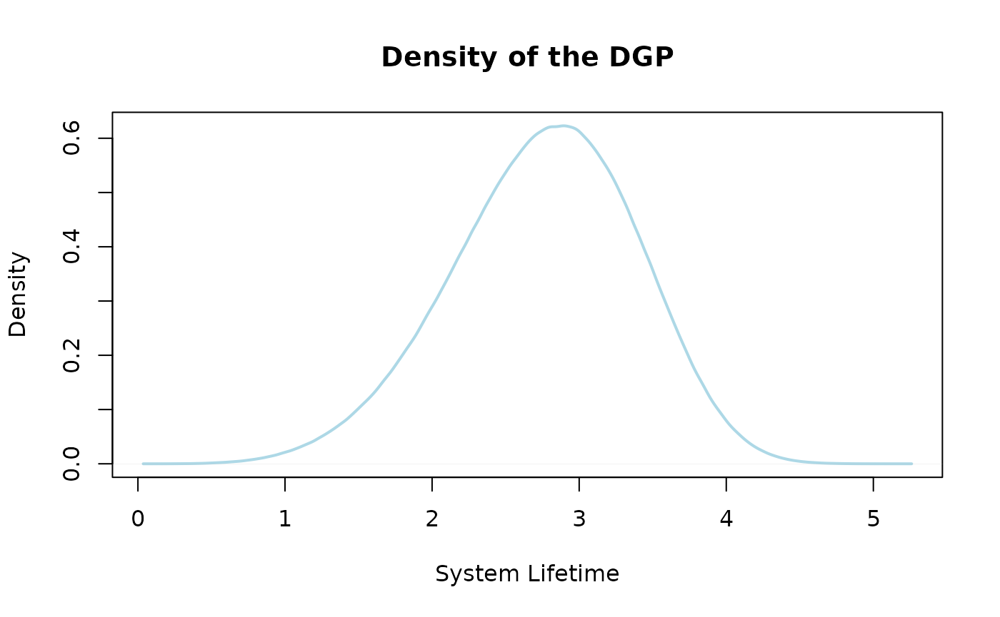
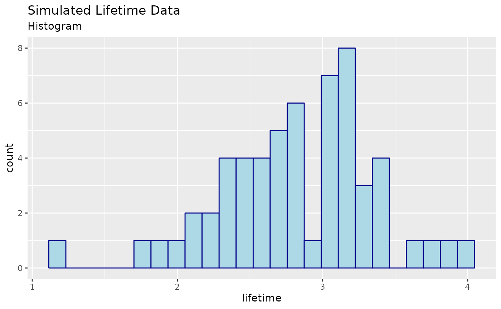
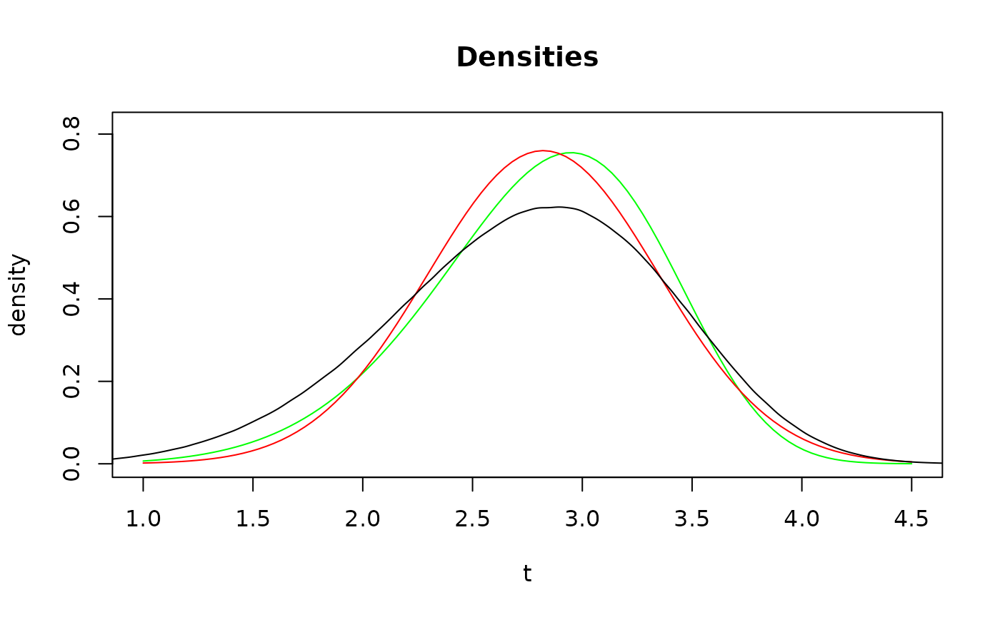

# Analysis of simple time series data

## Introduction

We are interested in the generative process that gave rise to the data
we observed. In the real world, systems are quite complex, but we settle
for simpler models for analytical tractability. So, we usually assume:

1.  The sample is i.i.d.

2.  The observations may be reasonably modeled by some relatively simple
    process.

3.  Other factors, like ambient temperature, are either negligible or
    are more or less constant in the sample.

Since this is a simulation, we know the underlying DGP (data generating
process). It’s just \\ T_i = W_i + \epsilon_i \\ where \\ W_i \sim
\operatorname{weibull}(k,\lambda) \\ and \\ \epsilon_i \sim
\operatorname{normal}(0,\sigma). \\

In the real world, we do not know the DGP. In this study, we will assume
that either \\T_1,\ldots,T_n\\ comes from Weibull or Normal. Clearly,
the true DGF is a bit more complicated but still very simple compared to
a more realistic DGP.

Then, the process of parametrically modeling the observed data may take
the following steps:

1.  Visualize the data, e.g., plot a histogram of the data.

2.  Guess which parametric distribution (for the components) might fit
    the observed data for the system lifetime.

3.  Use a statistical test for goodness-of-fit.

4.  Repeat steps 2 and 3 if the measure of goodness of fit is not
    satisfactory.

## Simulation parameters and generation

The simulation parameters are given by:

``` r
library(ggplot2)
library(tibble)
library(numDeriv)
library(stats)

sim.n <- 58
sim.err.sd <- 0.05
sim.shape <- 5
sim.scale <- 3
sim.theta = c(sim.shape,sim.scale)
set.seed(1234)
```

We generate the data with the following R code:

``` r
sim.df <- tibble(lifetime=
                     rweibull(n=sim.n,
                                   shape=sim.shape,
                                   scale=sim.scale) +
                     rnorm(n=sim.n,
                           mean=0,
                           sd=sim.err.sd))

dgp.density <- density(
  rweibull(n=10000000,
           shape=sim.shape,
           scale=sim.scale) +
  rnorm(n=10000000,
        mean=0,
        sd=sim.err.sd))
```

A density plot of the DGP is given by:

``` r

print(class(dgp.density))
#> [1] "density"
plot(dgp.density,
     main="Density of the DGP",
     xlab="System Lifetime",
     ylab="Density",
     col="light blue",
     lwd=2)
```



A few elements from the sample are given by:

    #> # A tibble: 58 × 1
    #>    lifetime
    #>       <dbl>
    #>  1     3.46
    #>  2     2.64
    #>  3     2.58
    #>  4     2.55
    #>  5     2.03
    #>  6     2.47
    #>  7     4.02
    #>  8     3.13
    #>  9     2.44
    #> 10     2.75
    #> # ℹ 48 more rows

## Visualizing the data

Visualizing the data is a good first step in the analysis of the data.
If the data is univariate or bivariate, we can plot a histogram of the
data pretty easily (if it’s multivariate, we can plot the marginal
distributions of the data).

We show a histogram of the simulated data below:


## Parametrically modeling the data

If we only had this sample, what might we conclude? This can be a very
difficult problem. In our case, we know that the simulated data is drawn
from the distribution \\T_i = W_i + \epsilon_i\\ where \\ W_i \sim
\operatorname{weibull}(\lambda = 5, k = 3) \\ and \\ \epsilon_i \sim
\operatorname{normal}(\mu=0,\sigma=0.05). \\ However, in real-world data
sets, we do not know the distribution. So, let us suppose that we do not
know the true distribution of the data.

If we were only interested in, say, *prediction*, and we had a
sufficiently large sample, we could use a non-parametric methods and
“let the data speak for itself.” However, if we are interested in
inference (e.g., explaining the data) or the sample was small, then we
need to make some assumptions about the data.

In this case, we will assume that the data is drawn from a parametric
distribution. There are many well-known, named parametric distributions,
e.g., Pareto, Weibull, and Normal, to name a few. From experience, it
seems like the Weibull and the normal might be good fits to the data.
However, note that since the normal distribution permits negative values
to be realized, it may not be an appropriate choice. Still, since these
are only approximations anyway, this may not be a big deal.

First, let us fit the Weibull distribution by choosing appropriate shape
\\\lambda\\ and scale \\k\\ parameters using the maximum likelihood
estimator.

To find the MLE of \\\theta = (\lambda,k)'\\, we need the log-likelihood
function `l.wei`, which is given by the following R code:

``` r
l.wei <- function(theta) sum(dweibull(sim.df$lifetime,
                                      shape=theta[1],
                                      scale=theta[2],
                                      log=T))
```

An MLE is a point \\(\hat\lambda,\hat k)'\\ that is a maximum of the
loglikelihood function, `l.wei`, over the parameter’s domain. We may use
the root-finding algorithm known as the Newton-Raphson method to find
where the gradient of the log-likelihood function `l.wei` is zero.

Here is the Newton-raphson code:

``` r
newton_raphson <- function(f, df, x0, tol=1e-4, maxiter=100L)
{
  fx <- f(x0)
  for (i in 1:maxiter)
  {
    if (max(abs(fx)) < tol) break
    J <- df(x0)
    d <- solve(J,fx)
    x0 <- x0 - d
    fx <- f(x0)
  }
  x0
}
```

The Newton-Raphson function is conventionally used to minimize a
function. We’re trying to maximize the log-likelihood function `l.wei`,
and so we’re trying to minimize the negative of the log-likelihood.
Thus, the gradient and Hessian is given by the negative of each.

Here’s the code:

``` r
newton_raphson(
    f=function(theta) -grad(l.wei,theta),
    df=function(theta) -hessian(l.wei,theta),
    x0=sim.theta)
#> [1] 6.140381 3.034467
```

The gradient should be approximately zero at the MLE. The Hessian is
also useful, since asymptotically the MLE follows a normal distribution
with a mean given by the true parameter and a variance-covariance given
by the negative inverse of the Hessian.

We have implemented more precise and more efficient algorithms for
computing the MLE of the Weibull distribution in the `algebraic.mle` R
package.

This function, `mle_weibull_shape_scale`, returns an `mle` object, which
has an API that provides a number of conventient methods, such as
estimating the variance-covariance matrix, confidence intervals, bias,
and so on. Here’s the code:

``` r
library(algebraic.mle)
mle.wei <- mle_weibull_shape_scale(sim.df$lifetime)
summary(mle.wei)
#> Maximum likelihood estimator of type mle_weibull_shape_scale is normally distributed.
#> The estimates of the parameters are given by:
#>    shape    scale 
#> 6.140382 3.034467 
#> The fisher information matrix (FIM) is given by:
#>          shape     scale
#> shape  2.91748  18.65922
#> scale 18.65922 314.84968
#> The variance-covariance matrix of the estimator is given by:
#>             shape        scale
#> shape  0.55197963 -0.032712474
#> scale -0.03271247  0.005114788
#> The asymptotic 95% confidence interval of the parameters are given by:
#>           2.5%    97.5%
#> shape 4.918333 7.362432
#> scale 2.916831 3.152104
#> The bias of the estimator is given by:
#> [1] 0 0
#> The MSE of the estimator is  0.5570944 .
#> The log-likelihood is  -44.58054 .
#> The AIC is  93.16108 .
#> The standard error is  0.7429533 0.07151775 .
```

Let’s do the same for the normal distribution. We will simply use the
`mle_normal_mu_var` function from the `algebraic.mle` package:

``` r
mle.norm <- mle_normal_mu_var(sim.df$lifetime)
summary(mle.norm)
#> Maximum likelihood estimator of type mle_normal_mu_var is normally distributed.
#> The estimates of the parameters are given by:
#>        mu       var 
#> 2.8220016 0.2756513 
#> The fisher information matrix (FIM) is given by:
#>          [,1]     [,2]
#> [1,] 210.4108   0.0000
#> [2,]   0.0000 381.6612
#> The variance-covariance matrix of the estimator is given by:
#>             [,1]        [,2]
#> [1,] 0.004752608 0.000000000
#> [2,] 0.000000000 0.002620125
#> The asymptotic 95% confidence interval of the parameters are given by:
#>          2.5%     97.5%
#> mu  2.7086068 2.9353964
#> var 0.1914559 0.3598466
#> The bias of the estimator is given by:
#>                       var 
#>  0.000000000 -0.004752608 
#> The MSE of the estimator is  0.00739532 .
#> The log-likelihood is  -44.92849 .
#> The AIC is  93.85698 .
#> The standard error is  0.06893916 0.05118715 .
```

Let’s plot the pdfs of the Weibull and normal distributions:

``` r
plot(function(x) dweibull(x,shape=point(mle.wei)[1],scale=point(mle.wei)[2]),
     xlim=c(1,4.5),ylim=c(0,.82),
     main="Densities", col="green",
     xlab="t", ylab="density")

# overlay the normal distribution pdf on the Weibull pdf plot
curve(dnorm(x,mean=point(mle.norm)[1],sd=sqrt(point(mle.norm)[2])),
      add=T,col="red")

lines(dgp.density, col="black")
```



In black, we have the true density. In green, we have the Weibull
density. In red, we have the normal density. From the plot, it’s hard to
tell which distribution is a better fit to the DGP.

How do we choose between the Weibull and the normal distribution? We
will discuss this in the next section.

## Goodness of fit

We are fitting a model to the data that does not precisely capture the
generative model \\W\\. So, how good of a fit is it?

We will conduct a goodness of fit test, \\\begin{align} H_0 &: \text{the
data is compatible with the Weibull distribution}\\ H_A &: \text{the
data is not compatible with the Weibull distribution}. \end{align}\\

To perform this test, we will use the Cramer-von Mises test. This test
is based on the Cramer-von Mises statistic, which is a measure of the
distance between the empirical distribution function of the data and the
distribution function of the model. The Cramer-von Mises statistic is
given by \\ \hat D_n^2 = \frac{1}{n}\sum\_{i=1}^n \left(\hat F_n(x_i) -
F(x_i)\right)^2 \\ where \\\hat F_n\\ is the empirical distribution
function of the data and \\F\\ is the distribution function of the
model.

``` r
cramer.test <- function(obs.dat,ref.dat)
{
  stat <- CDFt::CramerVonMisesTwoSamples(obs.dat,ref.dat)
  list(p.value=exp(-stat)/6.0,
       cramer.stat=stat,
       obs.size=length(obs.dat),
       ref.size=length(ref.dat))
}

wei.shape <- point(mle.wei)[1]
wei.scale <- point(mle.wei)[2]
ref.dat <- rweibull(1000000,shape=wei.shape,scale=wei.scale)
cramer.test(sim.df$lifetime,ref.dat)
#> $p.value
#> [1] 0.1589732
#> 
#> $cramer.stat
#> [1] 0.04726002
#> 
#> $obs.size
#> [1] 58
#> 
#> $ref.size
#> [1] 1000000
```

Looking at the \\p\\-value, we see that the data is compatible with the
Weibull distribution. Now, let’s do the same for the normal
distribution:

``` r
norm.mu <- point(mle.norm)[1]
norm.var <- point(mle.norm)[2]
ref.dat <- rnorm(1000000,mean=norm.mu,sd=sqrt(norm.var))
cramer.test(sim.df$lifetime,ref.dat)
#> $p.value
#> [1] 0.1569756
#> 
#> $cramer.stat
#> [1] 0.05990535
#> 
#> $obs.size
#> [1] 58
#> 
#> $ref.size
#> [1] 1000000
```

They are both compatible with the data. However, the Weibull
distribution has a larger \\p\\-value, which may suggest it is a better
fit. We also have the AIC measure of goodness of fit. The AIC is given
by \\ \text{AIC} = -2\log L + 2k, \\ where \\L\\ is the likelihood of
the model and \\k\\ is the number of parameters in the model. The AIC is
a measure of the tradeoff between the goodness of fit and the complexity
of the model.

``` r
aic(mle.wei)
#> [1] 93.16108
aic(mle.norm)
#>      var 
#> 93.85698
```

A lower AIC value indicates a better fit. Thus, according to this
measure, the Weibull distribution is the better fit.

## Conclusion

In this post, we have shown how to fit a Weibull distribution to data.
We have also shown how to fit a normal distribution to the same data. We
have shown how to compare the two models using the Cramer-von Mises test
and the AIC measure of goodness of fit.

We came to no definitive conclusion about which model is better, but the
Weibull distribution has a larger \\p\\-value from the Cramer-von Mises
test, and a lower AIC value. Thus, it may be the better fit, but we see
that the true DGP is visually different from both the Weibull and the
normal distributions. Notably, the DGP has longer tails than both,
suggesting that an even better fit may be a long-tail distribution like
the log-normal or the Pareto distribution.
